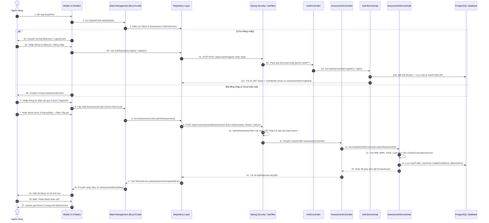

# Phân Tích & Theo Dõi Luồng Khảo Sát Thể Trạng (Assessment Flow) - BodyPilot

Tài liệu này tổng hợp toàn bộ quy trình, sơ đồ trình tự, ánh xạ file mã nguồn (**Flutter Mobile & Spring Boot Backend**) và công thức tính toán từ khi **Mở ứng dụng ➔ Đăng nhập / Khởi tạo User ➔ Khảo sát thể trạng ➔ Xử lý Backend ➔ Hiển thị kết quả ➔ Đến trang chủ**.

---

## 📌 1. Sơ Đồ Trình Tự Hoạt Động (Sequence Diagram)

---

## 🗂️ 2. Ánh Xạ File Mã Nguồn Chi Tiết Từng Giai Đoạn

### Giai Đoạn A: Khởi Chạy App & Kiểm Tra Token (Mobile)
| Bước | Tên File / Đường Dẫn | Thành Phần / Hàm Chính | Nhiệm Vụ |
| :--- | :--- | :--- | :--- |
| **A1** | [main.dart](file:///c:/Personal/DATN/BodyPilot/mobile/lib/main.dart) | `main()`, `BodyPilotApp` | Khởi tạo Hive, Services (`TokenService`, `OfflineSyncManager`), Cung cấp MultiBlocProvider |
| **A2** | [app_pages.dart](file:///c:/Personal/DATN/BodyPilot/mobile/lib/core/routes/app_pages.dart) | `AppPages.router` | Cấu hình GoRouter với `initialLocation = AppRoutes.splash` |
| **A3** | [splash_screen.dart](file:///c:/Personal/DATN/BodyPilot/mobile/lib/presentation/screens/welcome/splash_screen.dart) | `SplashScreenState` | Lắng nghe `SplashCubit` chuyển hướng màn hình dựa trên `SplashStatus` |
| **A4** | [splash_cubit.dart](file:///c:/Personal/DATN/BodyPilot/mobile/lib/presentation/bloc/splash/splash_cubit.dart) | `startSplash()` | Kiểm tra token JWT và cờ `isAssessmentCompleted` từ `TokenService` |
| **A5** | [token_service.dart](file:///c:/Personal/DATN/BodyPilot/mobile/lib/data/services/token_service.dart) | `isAssessmentCompleted()` | Đọc trạng thái khảo sát được lưu trong `SharedPreferences` |

---

### Giai Đoạn B: Bảo Mật, Khởi Tạo User & Authentication (Backend & Mobile)

#### 🛡️ Backend Security Infrastructure:
| Tên File / Đường Dẫn | Thành Phần / Annotation | Nhiệm Vụ |
| :--- | :--- | :--- |
| [SecurityConfig.java](file:///c:/Personal/DATN/BodyPilot/backend/src/main/java/com/bodypilot/backend/config/SecurityConfig.java) | `@Configuration`, `SecurityFilterChain` | Cấu hình Spring Security 6: Tắt CSRF, cho phép CORS (`*`), thiết lập Session Stateless, định tuyến cấp phép URL (`/api/v1/auth/**`, `/api/v1/users/**`). |
| [JwtAuthenticationFilter.java](file:///c:/Personal/DATN/BodyPilot/backend/src/main/java/com/bodypilot/backend/security/JwtAuthenticationFilter.java) | `@Component`, `OncePerRequestFilter` | Intercept HTTP request, trích xuất Header `Authorization: Bearer <token>`, giải mã Email và nạp `UsernamePasswordAuthenticationToken` vào `SecurityContextHolder`. |
| [JwtService.java](file:///c:/Personal/DATN/BodyPilot/backend/src/main/java/com/bodypilot/backend/security/JwtService.java) | `@Service` | Sinh JWT Token, trích xuất Claims (Subject/Email), kiểm tra thời hạn hết hạn (Expiration). |
| [ApplicationConfig.java](file:///c:/Personal/DATN/BodyPilot/backend/src/main/java/com/bodypilot/backend/config/ApplicationConfig.java) | `@Configuration` | Cung cấp các Bean: `AuthenticationManager`, `UserDetailsService`, `PasswordEncoder` (BCryptPasswordEncoder). |

#### 👤 Backend User Creation & Auth Flow:
| Bước | Tên File / Đường Dẫn | Thành Phần / Hàm Chính | Nhiệm Vụ |
| :--- | :--- | :--- | :--- |
| **B1** | [login_screen.dart](file:///c:/Personal/DATN/BodyPilot/mobile/lib/presentation/screens/auth/login_screen.dart) | `LoginView` | Thu thập Email/Password ➔ Bấm Đăng nhập ➔ Gọi `LoginCubit.submit()` |
| **B2** | [signup_screen.dart](file:///c:/Personal/DATN/BodyPilot/mobile/lib/presentation/screens/auth/signup_screen.dart) | `SignUpView` | Thu thập Họ tên/Email/Password ➔ Gọi `SignupCubit.submit()` |
| **B3** | [auth_repository.dart](file:///c:/Personal/DATN/BodyPilot/mobile/lib/data/repositories/auth_repository.dart) | `login()`, `register()` | Gọi API POST `/api/v1/auth/login` hoặc `/register` |
| **B4** | [AuthController.java](file:///c:/Personal/DATN/BodyPilot/backend/src/main/java/com/bodypilot/backend/controller/AuthController.java) | `@RestController`, `/api/v1/auth` | Đón request đăng ký (`/register`), đăng nhập (`/login`), Google Auth (`/google`) |
| **B5** | [AuthServiceImpl.java](file:///c:/Personal/DATN/BodyPilot/backend/src/main/java/com/bodypilot/backend/service/impl/AuthServiceImpl.java#L50-L75) | `register()` | Khởi tạo đối tượng `User` (mã hóa BCrypt password) & `UserProfile` mới, lưu DB và sinh JWT Token. |
| **B6** | [AuthServiceImpl.java](file:///c:/Personal/DATN/BodyPilot/backend/src/main/java/com/bodypilot/backend/service/impl/AuthServiceImpl.java#L78-L99) | `login()` | Xác thực thông qua `AuthenticationManager.authenticate()`, lấy thông tin User & sinh JWT Token. |
| **B7** | [UserServiceImpl.java](file:///c:/Personal/DATN/BodyPilot/backend/src/main/java/com/bodypilot/backend/service/impl/UserServiceImpl.java) | `getUserDetails()` | Lấy thông tin chi tiết User & UserProfile kèm cờ `isAssessmentCompleted` trả về cho Mobile. |
| **B8** | [User.java](file:///c:/Personal/DATN/BodyPilot/backend/src/main/java/com/bodypilot/backend/model/entity/user/User.java) | `@Entity`, `users` table | Entity đại diện cho tài khoản người dùng (`id`, `email`, `password`, `createdAt`). |
| **B9** | [UserProfile.java](file:///c:/Personal/DATN/BodyPilot/backend/src/main/java/com/bodypilot/backend/model/entity/user/UserProfile.java) | `@Entity`, `user_profiles` table | Entity đại diện cho hồ sơ cá nhân (`fullName`, `gender`, `heightCm`, `weight`, `isAssessmentCompleted`). |

---

### Giai Đoạn C: Các Bước Khảo Sát (9 Bước PageView UI)
Màn hình container chính: [assessment_screen.dart](file:///c:/Personal/DATN/BodyPilot/mobile/lib/presentation/screens/assessment/assessment_screen.dart)  
State Manager: [assessment_cubit.dart](file:///c:/Personal/DATN/BodyPilot/mobile/lib/presentation/bloc/assessment/assessment_cubit.dart) (Tự động cache dữ liệu tạm vào Hive `current_assessment`).

| Step | File Giao Diện | Hàm Gọi Trong Cubit | Nội Dung Khảo Sát |
| :---: | :--- | :--- | :--- |
| **1** | [goal_step.dart](file:///c:/Personal/DATN/BodyPilot/mobile/lib/presentation/screens/assessment/steps/goal_step.dart) | `selectGoal(goal)` | Mục tiêu (Giảm cân, Tăng cơ, Duy trì) |
| **2** | [gender_step.dart](file:///c:/Personal/DATN/BodyPilot/mobile/lib/presentation/screens/assessment/steps/gender_step.dart) | `selectGender(gender)` | Giới tính (Nam / Nữ) |
| **3** | [age_step.dart](file:///c:/Personal/DATN/BodyPilot/mobile/lib/presentation/screens/assessment/steps/age_step.dart) | `selectAge(age)` | Độ tuổi |
| **4** | [body_step.dart](file:///c:/Personal/DATN/BodyPilot/mobile/lib/presentation/screens/assessment/steps/body_step.dart) | `selectHeight()`, `selectWeight()` | Chiều cao (cm) & Cân nặng (kg) |
| **5** | [target_weight_step.dart](file:///c:/Personal/DATN/BodyPilot/mobile/lib/presentation/screens/assessment/steps/target_weight_step.dart) | `setTargetWeight(weight)` | Cân nặng mục tiêu (kg) |
| **6** | [experience_step.dart](file:///c:/Personal/DATN/BodyPilot/mobile/lib/presentation/screens/assessment/steps/experience_step.dart) | `setExperience(bool)` | Kinh nghiệm tập luyện (Đã từng / Chưa) |
| **7** | [activity_level_step.dart](file:///c:/Personal/DATN/BodyPilot/mobile/lib/presentation/screens/assessment/steps/activity_level_step.dart) | `selectActivityLevel(level)` | Mức độ vận động hàng ngày |
| **8** | [condition_step.dart](file:///c:/Personal/DATN/BodyPilot/mobile/lib/presentation/screens/assessment/steps/condition_step.dart) | `toggleCondition(code)` | Tiền sử bệnh lý (Tiểu đường, Huyết áp,...) |
| **9** | [injury_step.dart](file:///c:/Personal/DATN/BodyPilot/mobile/lib/presentation/screens/assessment/steps/injury_step.dart) | `submitAssessment()` | Vị trí chấn thương ➔ **Nút Nộp Bài** |

---

### Giai Đoạn D: Gửi Dữ Liệu Khảo Sát & Xử Lý Logic Trên Backend
| Bước | Tên File / Đường Dẫn | Thành Phần / Hàm Chính | Nhiệm Vụ |
| :--- | :--- | :--- | :--- |
| **D1** | [user_repository.dart](file:///c:/Personal/DATN/BodyPilot/mobile/lib/data/repositories/user_repository.dart#L62-L77) | `submitAssessment()` | Gửi request `POST /api/v1/users/{userId}/assessment` |
| **D2** | [AssessmentController.java](file:///c:/Personal/DATN/BodyPilot/backend/src/main/java/com/bodypilot/backend/controller/AssessmentController.java#L16-L22) | `submitAssessment()` | Tiếp nhận Endpoint `@PostMapping("/{userId}/assessment")` |
| **D3** | [AssessmentServiceImpl.java](file:///c:/Personal/DATN/BodyPilot/backend/src/main/java/com/bodypilot/backend/service/impl/AssessmentServiceImpl.java#L66-L234) | `submitAssessment()` | Thực thi giao dịch `@Transactional`: Cập nhật Profile, Mục tiêu, Bệnh lý |
| **D4** | [CalorieCalculatorService.java](file:///c:/Personal/DATN/BodyPilot/backend/src/main/java/com/bodypilot/backend/service/CalorieCalculatorService.java) | `calculateMetrics()` | Tính toán chỉ số sinh học BMI, BMR, TDEE, Target Calories |

---

### Giai Đoạn E: Kết Quả & Chuyển Hướng Màn Hình Chính
| Bước | Tên File / Đường Dẫn | Thành Phần / Hàm Chính | Nhiệm Vụ |
| :--- | :--- | :--- | :--- |
| **E1** | [assessment_result_step.dart](file:///c:/Personal/DATN/BodyPilot/mobile/lib/presentation/screens/assessment/steps/assessment_result_step.dart) | `AssessmentResultStep` | Hiển thị bảng kết quả phân tích BMI, BMR, TDEE, Calo mục tiêu |
| **E2** | [assessment_screen.dart](file:///c:/Personal/DATN/BodyPilot/mobile/lib/presentation/screens/assessment/assessment_screen.dart#L78-L84) | `onComplete` | Bấm nút "Hoàn thành khảo sát" ➔ Execution `context.go('/home')` |
| **E3** | [main_screen.dart](file:///c:/Personal/DATN/BodyPilot/mobile/lib/presentation/screens/main/main_screen.dart) | `MainScreen` | Chuyển hướng người dùng chính thức đến Trang Chủ ứng dụng |

---

## 🧮 3. Công Thức Tính Toán Sinh Học Được Áp Dụng

1. **Chỉ số Khối Cơ Thể (BMI)**:
   $$\text{BMI} = \frac{\text{Cân nặng (kg)}}{(\text{Chiều cao (m)})^2}$$
   *Phân loại WHO WPRO (Dành cho người Châu Á)*:
   - $< 18.5$: Thiếu cân
   - $18.5 - 22.9$: Thể trạng lý tưởng
   - $23.0 - 24.9$: Thừa cân
   - $25.0 - 29.9$: Béo phì độ I
   - $\ge 30.0$: Béo phì độ II

2. **Tỷ lệ Trao Đổi Chất Cơ Bản (BMR - Mifflin-St Jeor)**:
   $$\text{BMR} = 10 \times \text{Weight} + 6.25 \times \text{Height} - 5 \times \text{Age} + \text{GenderOffset}$$
   - Nam: $\text{GenderOffset} = +5$
   - Nữ: $\text{GenderOffset} = -161$

3. **Tổng Tiêu Hao Năng Lượng Hàng Ngày (TDEE)**:
   $$\text{TDEE} = \text{BMR} \times \text{Hệ số PAL}$$
   - Sedentary (Ít vận động): $1.2$
   - Light (Vận động nhẹ 1-3 ngày/tuần): $1.375$
   - Moderate (Vận động vừa 3-5 ngày/tuần): $1.55$
   - Active (Vận động nhiều 6-7 ngày/tuần): $1.725$
   - Very Active (Vận động nặng/Vận động viên): $1.9$

4. **Calo Mục Tiêu Nạp Vào (Target Calories)**:
   - Giảm 1.0kg/tuần: $\text{TDEE} - 1000$ kcal
   - Giảm 0.5kg/tuần: $\text{TDEE} - 500$ kcal
   - Tăng Cơ Nạc (Lean Bulk): $\text{TDEE} + 300$ kcal
   - Tăng 0.5kg/tuần: $\text{TDEE} + 500$ kcal
   - Duy trì vóc dáng: $\text{TDEE}$
