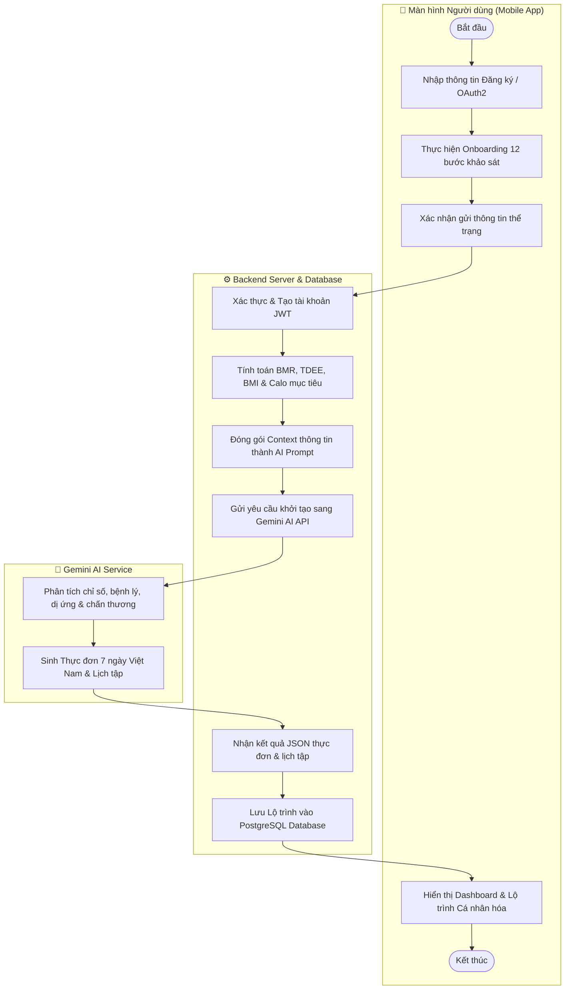
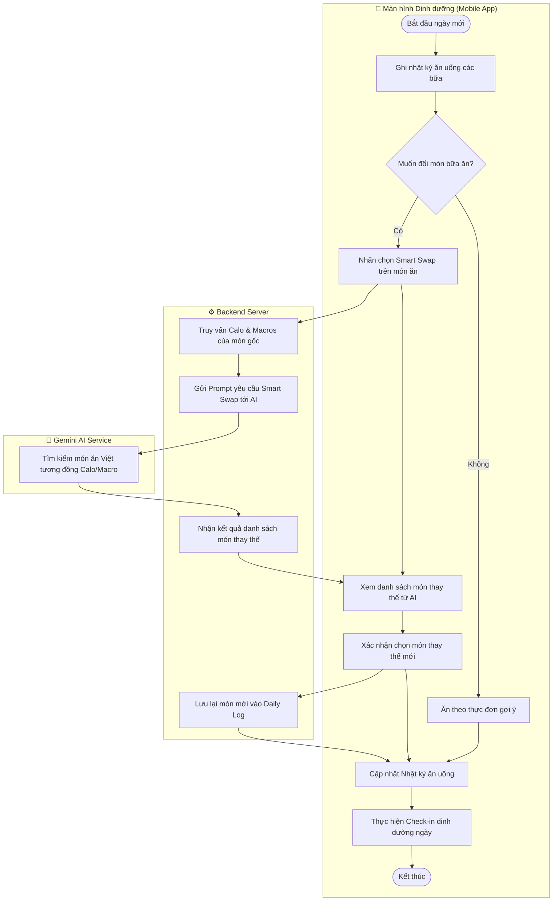
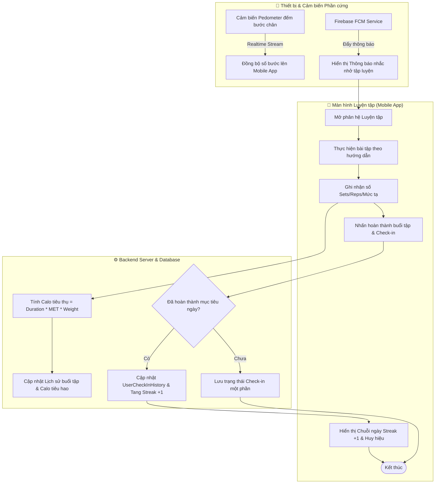
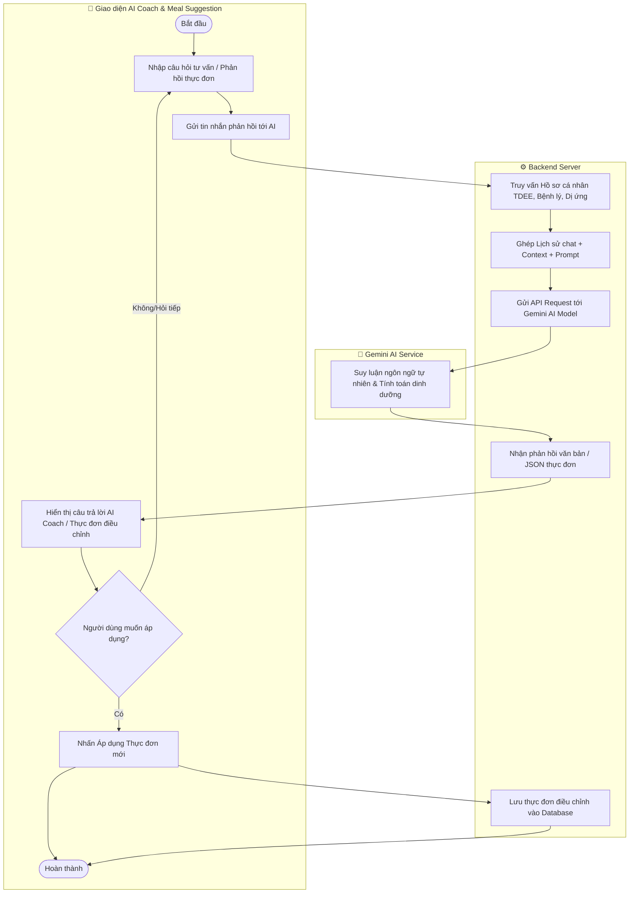

# QUY TRÌNH NGHIỆP VỤ HỆ THỐNG BODYPILOT

Tài liệu này mô tả các **Quy trình nghiệp vụ cốt lõi** của hệ thống **BodyPilot**. Quy trình nghiệp vụ là luồng hoạt động kết hợp nhiều Use Case khác nhau theo thời gian để hoàn thành một mục đích cụ thể của người dùng và hệ thống.

---

## 1. Quy trình 1: Đăng ký, Đánh giá Thể trạng và Khởi tạo Lộ trình Cá nhân hóa

### 1.1. Mô tả quy trình

Quy trình này diễn ra khi người dùng lần đầu gia nhập hệ thống BodyPilot. Quy trình kết hợp các Use Case: **Xác thực tài khoản (UC01)**, **Khảo sát chỉ số thể trạng (UC02)**, **Tính toán chỉ số sinh học (UC02.3)**, **Tạo thực đơn AI (UC05)** và **Tạo lịch tập AI (UC10)**.

1. **Bước 1:** Người dùng đăng ký tài khoản (qua Email hoặc Google OAuth2).
2. **Bước 2:** Người dùng thực hiện bộ khảo sát thể trạng Onboarding 12 bước (chiều cao, cân nặng, độ tuổi, mục tiêu, chấn thương, dị ứng thực phẩm, mức độ vận động).
3. **Bước 3:** Hệ thống tự động tính toán chỉ số sinh học BMR (Mifflin-St Jeor), TDEE, BMI và phân bổ hạn mức Calo & tỷ lệ Carbs/Protein/Fat mục tiêu.
4. **Bước 4:** Backend thu thập toàn bộ dữ liệu chỉ số và điều kiện lọc, đóng gói thành prompt gửi tới **Google Gemini AI**.
5. **Bước 5:** Gemini AI phân tích suy luận và trả về thực đơn 7 ngày thuần Việt cùng lộ trình luyện tập phù hợp.
6. **Bước 6:** Hệ thống lưu lộ trình vào cơ sở dữ liệu và hiển thị bảng điều khiển cá nhân hóa cho người dùng.

### 1.2. Biểu đồ hoạt động (Activity Diagram)

---

## 2. Quy trình 2: Theo dõi Dinh dưỡng Hàng ngày và Đổi món Thông minh (Smart Swap)

### 2.1. Mô tả quy trình

Quy trình này mô tả luồng làm việc hàng ngày của người dùng khi ghi nhận nhật ký ăn uống và linh hoạt điều chỉnh món ăn thông qua AI. Quy trình kết hợp các Use Case: **Ghi nhật ký ăn uống (UC03)**, **Tìm kiếm thực phẩm (UC04)**, **Đề xuất món ăn thay thế Smart Swap AI (UC06)** và **Điểm danh Check-in (UC12)**.

1. **Bước 1:** Người dùng mở nhật ký dinh dưỡng và thêm món ăn thực tế đã tiêu thụ vào các bữa (Sáng, Trưa).
2. **Bước 2:** Hệ thống tính tổng lượng Calo nạp vào và hiển thị thanh tiến độ so với hạn mức TDEE.
3. **Bước 3:** Đến bữa tối, người dùng không muốn ăn món ăn trong thực đơn mặc định nên nhấn chọn nút **Smart Swap (Đổi món)**.
4. **Bước 4:** Backend gửi thông tin món ăn cần thay thế cùng định mức Calo/Macros còn lại sang Gemini AI.
5. **Bước 5:** Gemini AI tìm kiếm và gợi ý các món ăn Việt Nam thay thế có giá trị dinh dưỡng tương đương.
6. **Bước 6:** Người dùng chọn món thay thế ưa thích; hệ thống tự động cập nhật lại thực đơn bữa tối và ghi nhận nhật ký ăn uống.
7. **Bước 7:** Hệ thống ghi nhận trạng thái **Check-in dinh dưỡng** ngày hôm đó cho người dùng.

### 2.2. Biểu đồ hoạt động (Activity Diagram)

---

## 3. Quy trình 3: Theo dõi Vận động, Đếm bước chân và Điểm danh Kiên trì (Daily Fitness Loop)

### 3.1. Mô tả quy trình

Quy trình này kết hợp các hoạt động thể chất trong ngày giữa phần cứng thiết bị di động, bài tập và hệ thống duy trì động lực. Quy trình kết hợp các Use Case: **Nhận thông báo nhắc nhở FCM (UC13)**, **Đếm bước chân tự động (UC09)**, **Ghi nhật ký luyện tập (UC07)** và **Thống kê Chuỗi Check-in Streak (UC12)**.

1. **Bước 1:** Nhận thông báo nhắc nhở vận động/tập luyện từ **Firebase FCM** vào khung giờ cố định.
2. **Bước 2:** Cảm biến phần cứng Pedometer trên điện thoại tự động ghi nhận số bước chân vận động liên tục trong ngày và đồng bộ lên ứng dụng.
3. **Bước 3:** Người dùng mở phân hệ Luyện tập, chọn bài tập trong giáo án và hoàn thành các hiệp tập (Sets/Reps/Tạ).
4. **Bước 4:** Hệ thống tính lượng calo đốt cháy dựa trên thời gian và chỉ số chuyển hóa **MET** của từng bài tập, sau đó cộng dồn vào tổng calo tiêu hao trong ngày.
5. **Bước 5:** Người dùng nhấn **Check-in hoàn thành luyện tập**.
6. **Bước 6:** Hệ thống kiểm tra điều kiện hoàn thành cả Dinh dưỡng & Luyện tập trong ngày, tự động cộng số ngày kiên trì liên tục (**Streak Count +1**).

### 3.2. Biểu đồ hoạt động (Activity Diagram)

hunn

---

## 4. Quy trình 4: Trợ lý AI Coach Tư vấn & Điều chỉnh Thực đơn theo Phản hồi người dùng

### 4.1. Mô tả quy trình

Quy trình này thể hiện vòng phản hồi thông minh (*Feedback Loop*) giữa người dùng và Trợ lý AI khi có nhu cầu tư vấn thắc mắc hoặc điều chỉnh kế hoạch ăn uống. Quy trình kết hợp các Use Case: **Trò chuyện AI Coach (UC11)** và **Điều chỉnh thực đơn gợi ý theo phản hồi (UC05.2)**.

1. **Bước 1:** Người dùng mở màn hình Trợ lý AI Coach hoặc màn hình Thực đơn gợi ý.
2. **Bước 2:** Người dùng nhập câu hỏi thắc mắc (ví dụ: *"Hôm nay tôi bị đau bụng thì nên ăn gì?"*) hoặc gửi phản hồi điều chỉnh (ví dụ: *"Tôi không thích ăn cá ngừ, hãy đổi sang thịt lợn"*).
3. **Bước 3:** Mobile App gửi tin nhắn kèm lịch sử trò chuyện cục bộ hoặc bối cảnh thực đơn hiện tại lên Backend Server.
4. **Bước 4:** Backend xây dựng Prompt nâng cao kết hợp chỉ số sinh học (TDEE, BMR, dị ứng) gửi tới Gemini AI.
5. **Bước 5:** Gemini AI đưa ra phản hồi tư vấn tự nhiên hoặc tái tạo lại danh sách món ăn mới tương thích.
6. **Bước 6:** Backend phản hồi kết quả về Mobile App; người dùng có thể trò chuyện tiếp hoặc nhấn **Đồng ý áp dụng thực đơn mới**.

### 4.2. Biểu đồ hoạt động (Activity Diagram)

