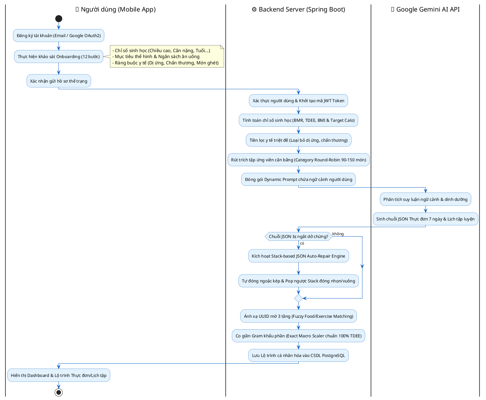
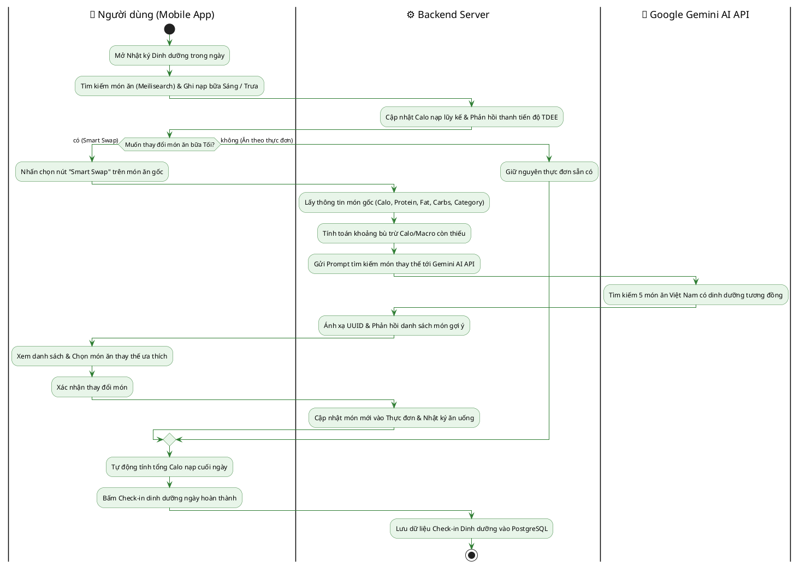
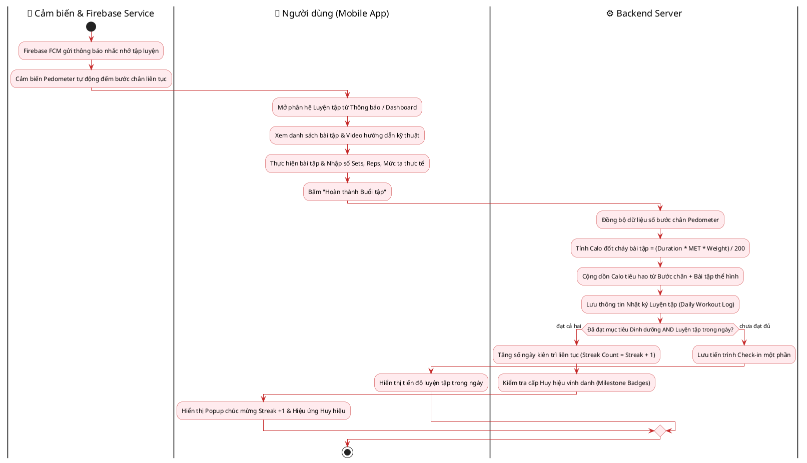
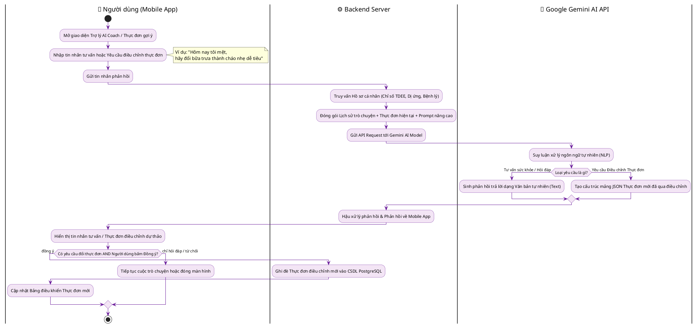
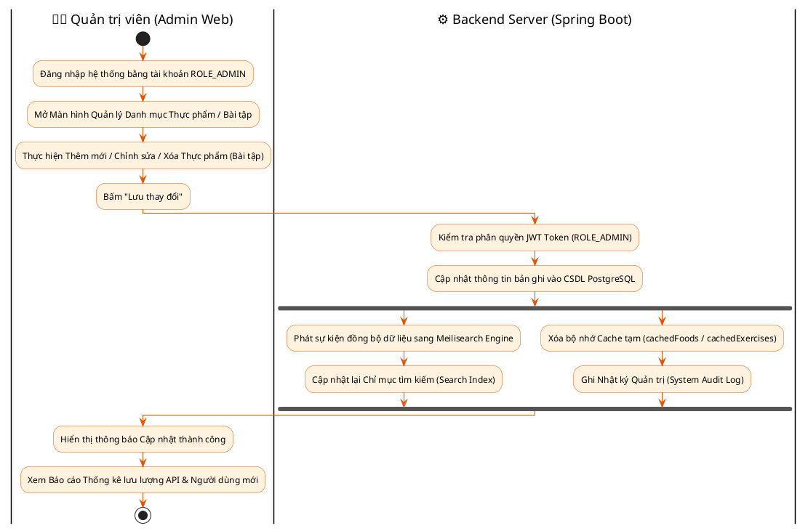

# QUY TRÌNH NGHIỆP VỤ HỆ THỐNG BODYPILOT

Tài liệu này mô tả 5 **Quy trình nghiệp vụ cốt lõi** của hệ thống **BodyPilot**. Mỗi quy trình nghiệp vụ là một chuỗi luồng hoạt động liên kết nhiều Use Case khác nhau theo thời gian để hoàn thành một mục tiêu toàn vẹn của người dùng và hệ thống.

---

## 1. Quy trình 1: Đăng ký, Đánh giá Thể trạng Onboarding và Khởi tạo Lộ trình AI Cá nhân hóa

### 1.1. Mô tả quy trình
Quy trình này diễn ra khi người dùng lần đầu gia nhập hệ thống BodyPilot. Kết hợp các Use Case: **UC01 (Xác thực tài khoản)**, **UC02 (Khảo sát thể trạng Onboarding)**, **UC02.3 (Tính toán chỉ số sinh học BMR/TDEE)**, **UC05 (Tạo thực đơn AI)** và **UC10 (Tạo lịch tập AI)**.

1. **Bước 1:** Người dùng đăng ký tài khoản (qua Email/Password hoặc Google OAuth2).
2. **Bước 2:** Người dùng thực hiện bộ khảo sát thể trạng Onboarding 12 bước (chiều cao, cân nặng, độ tuổi, mục tiêu, chấn thương, dị ứng thực phẩm, mức độ vận động, ngân sách).
3. **Bước 3:** Backend tính toán chỉ số sinh học BMR (Mifflin-St Jeor), TDEE, BMI và phân bổ hạn mức Calo & tỷ lệ Carbs/Protein/Fat mục tiêu.
4. **Bước 4:** Backend thực hiện lọc y tế triệt để, rút trích 90-150 món ăn ứng viên theo thuật toán Category Round-Robin và đóng gói Dynamic Context Prompt gửi tới **Google Gemini AI API**.
5. **Bước 5:** Gemini AI phân tích suy luận ngữ cảnh và trả về chuỗi JSON thực đơn 7 ngày thuần Việt cùng lộ trình luyện tập phù hợp.
6. **Bước 6:** Backend tự vá JSON ngắt dở bằng Stack (`repairTruncatedJsonNode`), ánh xạ UUID thực phẩm 3 tầng (`Fuzzy Matching`), co giãn Gram theo `Macro Scaler` chuẩn 100% TDEE và lưu vào PostgreSQL Database.
7. **Bước 7:** Mobile App hiển thị Bảng điều khiển & Lộ trình cá nhân hóa cho người dùng.

### 1.2. Biểu đồ hoạt động (PlantUML Activity Diagram)

---

## 2. Quy trình 2: Theo dõi Dinh dưỡng Hàng ngày, Ghi Nhật ký và Đổi món Thông minh (AI Smart Swap)

### 2.1. Mô tả quy trình
Quy trình mô tả luồng làm việc hàng ngày của người dùng khi ghi nhận nhật ký ăn uống và linh hoạt điều chỉnh món ăn thông qua AI. Kết hợp các Use Case: **UC03 (Ghi nhật ký ăn uống)**, **UC04 (Tìm kiếm thực phẩm Meilisearch)**, **UC06 (Đổi món thông minh Smart Swap AI)** và **UC12 (Check-in dinh dưỡng)**.

1. **Bước 1:** Người dùng mở nhật ký dinh dưỡng và nạp các món ăn đã tiêu thụ vào bữa Sáng, Bữa Trưa (tìm kiếm qua Meilisearch Engine).
2. **Bước 2:** Hệ thống tính tổng Calo nạp lũy kế và phản hồi tiến độ TDEE về ứng dụng di động.
3. **Bước 3:** Đến bữa Tối, người dùng không muốn ăn món ăn gợi ý sẵn trong thực đơn nên bấm chọn **Smart Swap (Đổi món)**.
4. **Bước 4:** Backend tính toán Calo/Macro còn thiếu trong ngày và gửi yêu cầu đổi món tới Gemini AI API.
5. **Bước 5:** Gemini AI tìm kiếm và trả về danh sách 5 món ăn Việt Nam thay thế có dinh dưỡng tương đồng.
6. **Bước 6:** Người dùng chọn món thay thế ưa thích; hệ thống tự động cập nhật lại thực đơn bữa Tối và ghi nhận nhật ký ăn uống.
7. **Bước 7:** Hệ thống ghi nhận trạng thái Check-in dinh dưỡng hoàn thành cho ngày hôm đó.

### 2.2. Biểu đồ hoạt động (PlantUML Activity Diagram)

---

## 3. Quy trình 3: Theo dõi Luyện tập, Đếm bước chân Pedometer và Điểm danh Kiên trì (Daily Fitness Loop)

### 3.1. Mô tả quy trình
Quy trình phối hợp các hoạt động thể chất giữa phần cứng cảm biến di động, bài tập thể hình và hệ thống duy trì động lực. Kết hợp các Use Case: **UC13 (Thông báo Firebase FCM)**, **UC09 (Đếm bước chân Pedometer)**, **UC07 (Ghi nhật ký luyện tập)** và **UC12 (Thống kê Chuỗi Streak)**.

1. **Bước 1:** Firebase FCM gửi thông báo nhắc nhở tập luyện vào khung giờ cố định.
2. **Bước 2:** Cảm biến Pedometer trên điện thoại đếm số bước chân vận động liên tục trong ngày và đồng bộ ngầm lên ứng dụng.
3. **Bước 3:** Người dùng mở màn hình Luyện tập, thực hiện các bài tập thể hình (xem video hướng dẫn, nhập số Sets/Reps/Mức tạ).
4. **Bước 4:** Backend tính Calo đốt cháy bài tập dựa trên thời gian và chỉ số chuyển hóa MET ($Calories = Duration \times MET \times Weight / 200$), sau đó cộng dồn với Calo tiêu hao từ bước chân.
5. **Bước 5:** Người dùng nhấn bấm **Hoàn thành Buổi tập & Check-in**.
6. **Bước 6:** Backend kiểm tra điều kiện hoàn thành cả Dinh dưỡng & Luyện tập trong ngày để tự động tăng chuỗi kiên trì (**Streak Count +1**).

### 3.2. Biểu đồ hoạt động (PlantUML Activity Diagram)

---

## 4. Quy trình 4: Trợ lý AI Coach Tư vấn & Điều chỉnh Thực đơn theo Phản hồi Người dùng (AI Coach Feedback Loop)

### 4.1. Mô tả quy trình
Quy trình thể hiện vòng phản hồi thông minh (*Feedback Loop*) giữa người dùng và Trợ lý AI khi có nhu cầu tư vấn hoặc điều chỉnh kế hoạch ăn uống. Kết hợp các Use Case: **UC11 (Trò chuyện AI Coach)** và **UC05.2 (Tái tạo thực đơn theo phản hồi)**.

1. **Bước 1:** Người dùng mở màn hình Trợ lý AI Coach hoặc màn hình Thực đơn gợi ý.
2. **Bước 2:** Người dùng nhập câu hỏi tư vấn sức khỏe hoặc gửi phản hồi điều chỉnh thực đơn.
3. **Bước 3:** Mobile App gửi tin nhắn kèm lịch sử hội thoại và bối cảnh thực đơn hiện tại lên Backend Server.
4. **Bước 4:** Backend đóng gói System Context Prompt (chỉ số TDEE, BMR, dị ứng) gửi tới Gemini AI API.
5. **Bước 5:** Gemini AI phân tích suy luận. Nếu là câu hỏi tư vấn, AI trả về câu trả lời tự nhiên (Text). Nếu là yêu cầu đổi thực đơn, AI trả về mảng JSON thực đơn mới đã qua điều chỉnh.
6. **Bước 6:** Mobile App hiển thị kết quả. Khi người dùng bấm **"Đồng ý áp dụng"**, Backend sẽ tiến hành ghi đè thực đơn mới vào CSDL PostgreSQL.

### 4.2. Biểu đồ hoạt động (PlantUML Activity Diagram)

---

## 5. Quy trình 5: Quản trị Nội dung Danh mục Thực phẩm / Bài tập và Kiểm duyệt Hệ thống (Admin Moderation Workflow)

### 5.1. Mô tả quy trình
Quy trình dành cho Quản trị viên (Admin) vận hành hệ thống trên trang **Admin Web Dashboard**. Kết hợp các Use Case: **UC14 (Quản lý danh mục thực phẩm)**, **UC15 (Quản lý danh mục bài tập)** và **UC16 (Báo cáo & Thống kê hệ thống)**.

1. **Bước 1:** Quản trị viên đăng nhập vào Admin Web Dashboard bằng tài khoản có quyền `ROLE_ADMIN`.
2. **Bước 2:** Admin thực hiện Thêm mới / Chỉnh sửa / Xóa thông tin món ăn hoặc bài tập thể hình.
3. **Bước 3:** Backend cập nhật thông tin bản ghi vào CSDL PostgreSQL.
4. **Bước 4:** Backend phát sự kiện đồng bộ bản ghi mới sang **Meilisearch Engine** để cập nhật chỉ mục tìm kiếm siêu tốc.
5. **Bước 5:** Backend làm mới bộ nhớ Cache tạm (`cachedFoods` / `cachedExercises`) và ghi Nhật ký Quản trị (System Audit Log).
6. **Bước 6:** Admin xem các báo cáo thống kê quy mô ứng dụng và hiệu năng hệ thống.

### 5.2. Biểu đồ hoạt động (PlantUML Activity Diagram)

