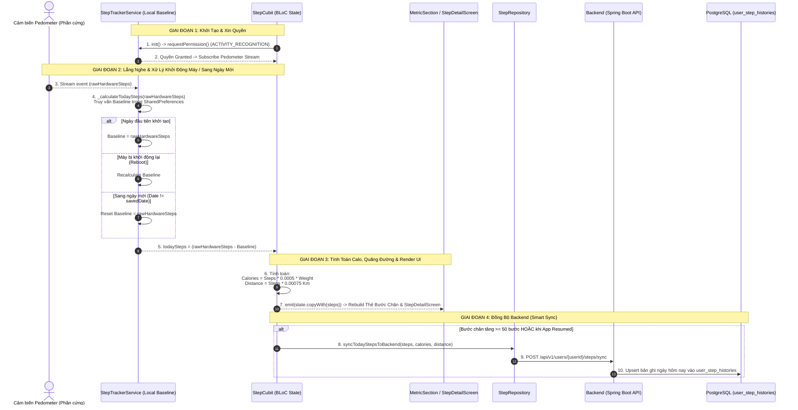

# Phân Tích Kỹ Thuật Chi Tiết: Luồng, Mã Nguồn & Các Hàm Cốt Lõi - BodyPilot

Tài liệu này phân tích chi tiết luồng điều hướng, kiến trúc BLoC, **Các Hàm Tính Toán Sinh Học / Calo Cốt Lõi**, **Luồng Tính Số Bước Chân (Step Tracker Flow)**, **Kiến Trúc SQLite Cache Cho 1,000+ Bài Tập (Workout SQLite Integration)** và các **Hàm Đồng Bộ Dữ Liệu Được Dùng Nhiều Nhất (Frontend & Backend)**.

---

## 🏋️ 1. Kiến Trúc SQLite Cache Cho Gần 1,000 Bài Tập (Workout SQLite Engine)

Khi quy mô danh mục bài tập thể hình/cardio mở rộng lên tới **gần 1,000 bài tập**, hệ thống đã chính thức nâng cấp sang mô hình **Bộ Nhớ Đệm SQLite Cục Bộ Song Song (Dual SQLite Local Cache)** giống như thực phẩm (Food).

```
                      [Yêu Cầu Tìm Kiếm Bài Tập / Kế Hoạch]
                                        │
                                        ▼
                           ┌─────────────────────────┐
                           │ 1. RAM Cache (_plans)   │ ➔ Trả về 0ms nếu đã nạp
                           └─────────────────────────┘
                                        │ (Nếu chưa có)
                                        ▼
                         ┌─────────────────────────────┐
                         │ 2. HTTP API (Spring Boot)   │ ➔ GET /exercises/search (~150ms)
                         └─────────────────────────────┘
                                        │ (Async Batch Insert vào SQLite)
                                        ▼
                           ┌─────────────────────────┐
                           │ 3. SQLite workout_cache │ ➔ Tra cứu Offline B-Tree Index
                           └─────────────────────────┘
```

### 🗂️ Chi Tiết Triển Khai Kỹ Thuật:

1. **File Khởi Tạo SQLite**: [workout_database_helper.dart](file:///c:/Personal/DATN/BodyPilot/mobile/lib/data/local/sqlite/workout_database_helper.dart)
   - Khởi tạo file SQLite database `workout_cache.db` chứa 2 bảng:
     - `exercises`: Lưu danh mục gần 1,000 bài tập (id, name, code, difficulty, bodyPartId, categoryId, targetMuscleId, rawJson).
     - `workout_plans`: Lưu danh sách các kế hoạch tập.
   - Thiết lập **5 chỉ mục B-Tree Indexes** (`idx_exercises_name`, `idx_exercises_bodypart`, `idx_exercises_difficulty`, `idx_exercises_category`, `idx_plans_goal`) giúp tìm kiếm theo tên/vùng cơ/độ khó dưới $2\text{ms}$.

2. **Cơ Chế Tìm Kiếm & Offline Fallback Trong Repository**: [workout_repository.dart](file:///c:/Personal/DATN/BodyPilot/mobile/lib/data/repositories/workout_repository.dart)
   - **Hàm `searchExercises(query, bodyPartId, categoryId, difficulty, page, size)`**:
     - Bắn HTTP Request `GET /exercises/search` lên Server.
     - Nhận response ➔ Tự động gọi `WorkoutDatabaseHelper.instance.insertExercises()` lưu nén JSON vào SQLite dưới dạng Batch Transaction.
     - Khi mất mạng hoặc Server nghẽn ➔ Tự động bắt lỗi và chuyển hướng qua `searchExercisesOffline()`, tìm kiếm trực tiếp trên ổ đĩa local mà không bị gián đoạn trải nghiệm người dùng!

---

## 🏃 2. Chi Tiết Luồng Đếm Bước Chân & Thuật Toán Pedometer (Step Tracker Flow)



---

## 🧮 3. Các Hàm Tính Toán Sinh Học & Calo Cốt Lõi (Core Metric & Calorie Calculations)

### A. Phía Backend (Spring Boot - Java):

#### 1️⃣ `CalorieCalculatorService.calculateMetrics(user, profile, goals)`
* **Vị trí file**: `backend/src/main/java/com/bodypilot/backend/service/CalorieCalculatorService.java`
* **Công thức toán học**:
  - **BMR (Mifflin-St Jeor)**: 
    $$\text{BMR} = 10 \times \text{weight} + 6.25 \times \text{height} - 5 \times \text{age} + (\text{Nam}: +5, \text{Nữ}: -161)$$
  - **TDEE (Tổng tiêu hao)**: $\text{TDEE} = \text{BMR} \times \text{PAL}$ (với PAL từ $1.2$ đến $1.9$).
  - **Calo Mục Tiêu (Target Calories)**: $\text{Target Cal} = \text{TDEE} \pm \Delta_{\text{goal}}$ ($-1000, -500, 0, +300, +500, +1000$).
* **Nơi sử dụng**: `AssessmentServiceImpl`, `CheckInServiceImpl`, `UserServiceImpl`.

#### 2️⃣ `NutritionDiaryServiceImpl.recalculateDailyTotals(diary)`
* **Vị trí file**: `backend/src/main/java/com/bodypilot/backend/service/impl/NutritionDiaryServiceImpl.java`
* **Nhiệm vụ**: Tự động cộng dồn `totalCaloriesEaten`, `totalProteinGrams`, `totalFatGrams`, `totalCarbsGrams` từ tất cả món ăn có `isEaten = true`.

#### 3️⃣ `WorkoutDiaryServiceImpl.recalculateWorkoutTotals(diary)`
* **Vị trí file**: `backend/src/main/java/com/bodypilot/backend/service/impl/WorkoutDiaryServiceImpl.java`
* **Nhiệm vụ**: Tự động cộng dồn `totalCaloriesBurned` và `totalDurationMinutes` từ tất cả bài tập có `isCompleted = true`.

---

## ⚡ 4. Các Hàm Nạp & Đồng Bộ Dữ Liệu Được Gọi Nhiều Nhất (Heavy-duty Interconnected Functions)

| Tên Hàm | Vị Trí File Code | Nhiệm Vụ & Mối Liên Kết Giữa Các Screens |
| :--- | :--- | :--- |
| **`Future.wait([...])`** | [home_screen.dart:L43](file:///c:/Personal/DATN/BodyPilot/mobile/lib/presentation/screens/home/home_screen.dart#L43) | Nạp bất đồng bộ song song 5 API cùng lúc khi vào Trang chủ hoặc kéo Refresh |
| **`userCubit.fetchUserProfile()`** | [user_cubit.dart](file:///c:/Personal/DATN/BodyPilot/mobile/lib/presentation/bloc/user/user_cubit.dart) | Gọi `GET /api/v1/users/{userId}`. Dùng ở Splash, Assessment, Check-in, và Home |
| **`getDailyEatingRange()`** | [nutrition_diary_repository.dart](file:///c:/Personal/DATN/BodyPilot/mobile/lib/data/repositories/nutrition_diary_repository.dart) | Gọi `GET /api/v1/nutrition-diary/range`. Dùng ở Trang chủ, `CalorieBalanceDetailScreen`, `ProteinDetailScreen` |
| **`getDailyWorkoutRange()`** | [workout_diary_repository.dart](file:///c:/Personal/DATN/BodyPilot/mobile/lib/data/repositories/workout_diary_repository.dart) | Gọi `GET /api/v1/workout-diary/range`. Dùng ở Trang chủ, `CalorieBalanceDetailScreen`, `ActiveMinutesDetailScreen` |
| **`searchExercises()`** | [workout_repository.dart](file:///c:/Personal/DATN/BodyPilot/mobile/lib/data/repositories/workout_repository.dart) | Tìm kiếm & phân trang 1,000+ bài tập với SQLite Cache & Offline Fallback |
