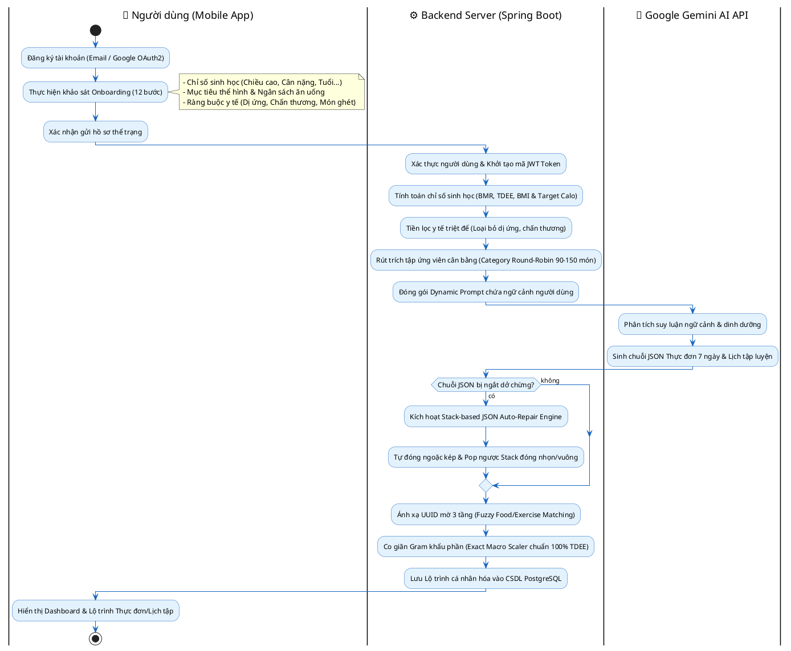
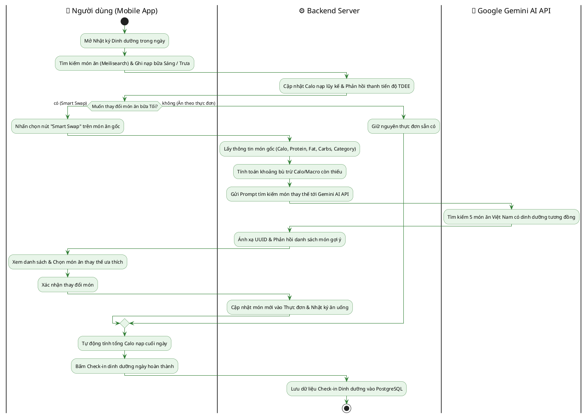
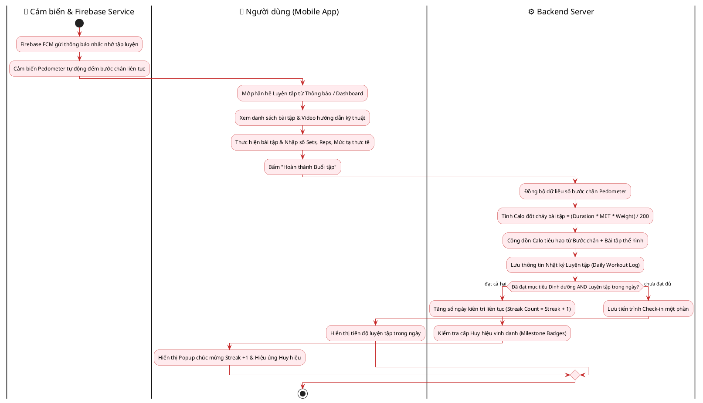
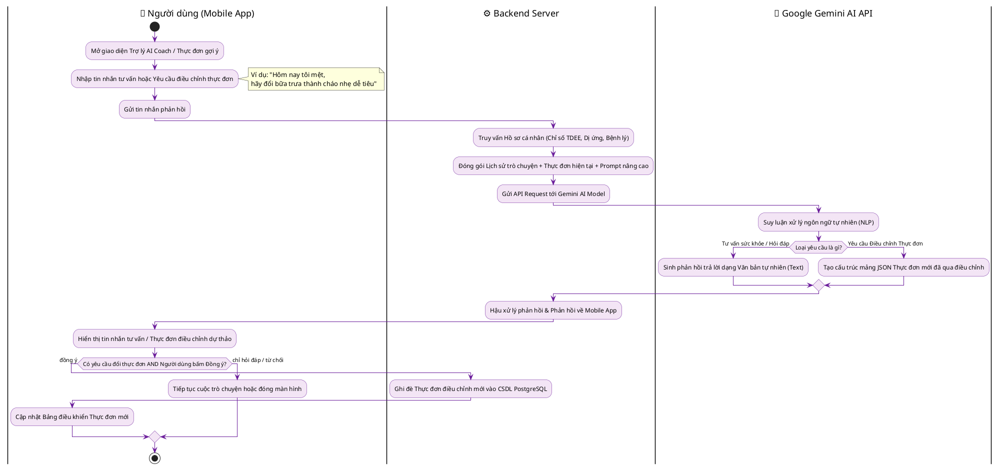
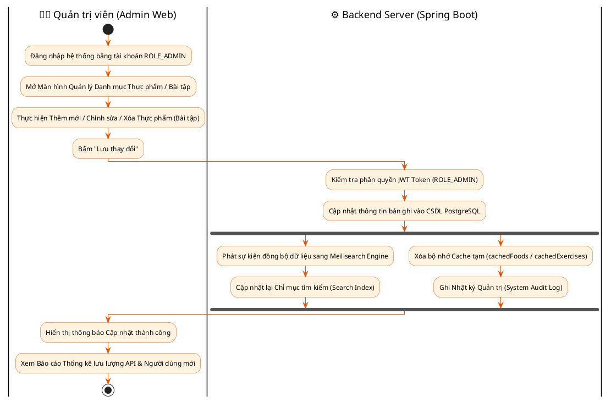
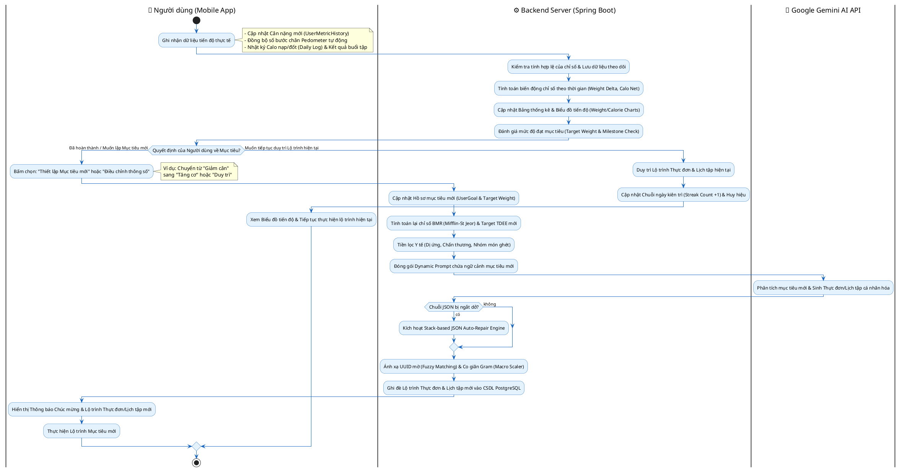

# CHƯƠNG 4: THIẾT KẾ QUY TRÌNH NGHIỆP VỤ HỆ THỐNG BODYPILOT

---

## 4.1. Tổng quan về các Quy trình Nghiệp vụ Cốt lõi

Các quy trình nghiệp vụ (Business Workflows) đóng vai trò là xương sống vận hành của hệ thống **BodyPilot**. Không chỉ đơn thuần là luồng sự kiện của từng Use Case đơn lẻ, quy trình nghiệp vụ thể hiện sự phối hợp nhịp nhàng giữa nhiều Use Case, nhiều tầng kiến trúc (Mobile App Client, Backend Spring Boot Server, PostgreSQL Database, Meilisearch Engine, Firebase Services và Gemini AI Model) qua các khoảng thời gian khác nhau nhằm hoàn thành một mục tiêu toàn vẹn của người dùng.

Hệ thống **BodyPilot** bao gồm 5 Quy trình Nghiệp vụ Cốt lõi:

1. **Quy trình 1:** Đăng ký, Đánh giá Thể trạng Onboarding và Khởi tạo Lộ trình AI Cá nhân hóa.
2. **Quy trình 2:** Theo dõi Dinh dưỡng Hàng ngày, Ghi Nhật ký và Đổi món Thông minh (AI Smart Swap).
3. **Quy trình 3:** Theo dõi Luyện tập, Đếm bước chân Pedometer và Điểm danh Kiên trì (Daily Fitness & Streak Tracking Loop).
4. **Quy trình 4:** Trợ lý AI Coach Tư vấn & Điều chỉnh Thực đơn theo Phản hồi Người dùng (AI Coach Feedback Loop & Re-generation).
5. **Quy trình 5:** Quản trị Nội dung Danh mục Thực phẩm / Bài tập và Theo dõi Báo cáo (Admin Content Management & System Audit Workflow).

---

## 4.2. Chi tiết các Quy trình Nghiệp vụ và Biểu đồ Hoạt động (PlantUML Activity Diagrams)

### 4.2.1. Quy trình 1: Đăng ký, Đánh giá Thể trạng Onboarding và Khởi tạo Lộ trình AI Cá nhân hóa

#### 1. Mô tả chi tiết quy trình

Luồng nghiệp vụ phối hợp các Use Case: **UC01 (Xác thực tài khoản)**, **UC02 (Khảo sát thể trạng Onboarding)**, **UC02.3 (Tính toán chỉ số BMR/TDEE)**, **UC05 (Tạo thực đơn AI)** và **UC10 (Tạo lịch tập AI)**.

- **Khởi đầu:** Người dùng mở ứng dụng di động, thực hiện đăng ký tài khoản (qua Email/Password hoặc Google OAuth2).
- **Thu thập ngữ cảnh:** Người dùng tham gia khảo sát Onboarding 12 bước (Giới tính, Tuổi, Chiều cao, Cân nặng, Mức độ vận động, Mục tiêu thể hình, Ngân sách, Dị ứng thực phẩm, Nhóm món ăn ghét, Bệnh lý/Chấn thương).
- **Xử lý số liệu:** Máy chủ Backend tính toán $BMR$ (Mifflin-St Jeor), $TDEE$, hạn mức Calo mục tiêu và tỷ lệ phân bổ Macros (Carbs/Protein/Fat).
- **Tiền lọc Y tế & Rút trích Candidates:** Backend lọc bỏ tuyệt đối các món ăn chứa dị ứng/chấn thương và rút trích tập ứng viên cân bằng 90-150 món theo thuật toán Category Round-Robin.
- **Tương tác AI:** Backend đóng gói Dynamic Prompt gửi tới Google Gemini AI API để sinh chuỗi JSON thực đơn 7 ngày và lịch tập thể hình.
- **Hậu xử lý & Lưu trữ:** Backend chạy bộ vá JSON bằng Stack (`repairTruncatedJsonNode`), ánh xạ UUID thực phẩm 3 tầng (`Fuzzy Matching`), co giãn Gram theo `Macro Scaler` chuẩn $100\% TDEE$ và lưu vào cơ sở dữ liệu PostgreSQL.
- **Kết thúc:** Mobile App nhận DTO kết quả và hiển thị Bảng điều khiển cá nhân hóa cho người dùng.

#### 2. Mã PlantUML Biểu đồ hoạt động (Activity Diagram)

---

### 4.2.2. Quy trình 2: Theo dõi Dinh dưỡng Hàng ngày, Ghi Nhật ký và Đổi món Thông minh (AI Smart Swap)

#### 1. Mô tả chi tiết quy trình

Luồng nghiệp vụ kết hợp các Use Case: **UC03 (Ghi nhật ký ăn uống)**, **UC04 (Tìm kiếm thực phẩm Meilisearch)**, **UC06 (Đổi món thông minh Smart Swap AI)** và **UC12 (Check-in dinh dưỡng)**.

- **Theo dõi nhật ký:** Người dùng mở màn hình dinh dưỡng, tìm kiếm món ăn bằng công cụ Meilisearch siêu tốc và nạp thực phẩm tiêu thụ thực tế vào nhật ký bữa Sáng, Bữa Trưa.
- **Tính toán Calo lũy kế:** Backend tính tổng Calo và Macros đã nạp trong ngày, phản hồi tiến độ về Mobile App.
- **Nhu cầu đổi món:** Đến bữa Tối, người dùng không muốn ăn món ăn gợi ý sẵn trong thực đơn nên bấm chọn **Smart Swap (Đổi món)**.
- **Gợi ý món tương đồng:** Backend tính lượng Calo/Macro còn thiếu trong ngày, truy vấn tập ứng viên tương đồng về dinh dưỡng và danh mục, gửi yêu cầu tới Gemini AI để tìm ra 5 món ăn thay thế chuẩn Việt Nam.
- **Cập nhật thực đơn:** Người dùng chọn món thay thế ưa thích; Backend tự động cập nhật lại thực đơn Bữa Tối và tính toán lại các chỉ số dinh dưỡng.
- **Điểm danh ngày:** Người dùng hoàn thành dinh dưỡng ngày và bấm Check-in.

#### 2. Mã PlantUML Biểu đồ hoạt động (Activity Diagram)

---

### 4.2.3. Quy trình 3: Theo dõi Luyện tập, Đếm bước chân Pedometer và Điểm danh Kiên trì (Daily Fitness & Streak Tracking Loop)

#### 1. Mô tả chi tiết quy trình

Luồng nghiệp vụ phối hợp giữa cảm biến di động, tính toán thể lực và hệ thống duy trì động lực, kết hợp các Use Case: **UC13 (Thông báo Firebase FCM)**, **UC09 (Đếm bước chân Pedometer)**, **UC07 (Ghi nhật ký luyện tập)** và **UC12 (Thống kê Chuỗi Streak)**.

- **Nhắc nhở tự động:** Firebase FCM gửi thông báo đẩy nhắc nhở tập luyện vào khung giờ cố định đã cài đặt.
- **Tự động thu thập vận động:** Cảm biến Pedometer trên điện thoại đếm số bước chân vận động liên tục trong ngày và đồng bộ ngầm lên ứng dụng.
- **Thực hiện bài tập:** Người dùng mở màn hình Luyện tập, tập theo danh sách bài tập AI gợi ý (xem video hướng dẫn, đếm số Sets/Reps/Mức tạ).
- **Tính calo tiêu hao:** Backend tính toán lượng Calo đốt cháy dựa trên thời gian tập, trọng lượng cơ thể và chỉ số chuyển hóa **MET** ($Calories = Duration \times MET \times Weight / 200$), sau đó cộng dồn với Calo tiêu hao từ số bước chân.
- **Cập nhật Streak:** Người dùng bấm hoàn thành buổi tập. Backend kiểm tra điều kiện hoàn thành cả Dinh dưỡng & Luyện tập trong ngày để tự động tăng chuỗi kiên trì (**Streak Count +1**).

#### 2. Mã PlantUML Biểu đồ hoạt động (Activity Diagram)

---

### 4.2.4. Quy trình 4: Trợ lý AI Coach Tư vấn & Điều chỉnh Thực đơn theo Phản hồi Người dùng (AI Coach Feedback Loop)

#### 1. Mô tả chi tiết quy trình

Luồng nghiệp vụ thể hiện khả năng trò chuyện và thích ứng thông minh của AI khi người dùng đưa ra phản hồi hoặc câu hỏi thắc mắc. Phối hợp các Use Case: **UC11 (Trò chuyện AI Coach)** và **UC05.2 (Tái tạo thực đơn theo phản hồi)**.

- **Tương tác câu hỏi/phản hồi:** Người dùng nhập câu hỏi tư vấn sức khỏe hoặc gửi phản hồi điều chỉnh thực đơn (ví dụ: *"Hôm nay tôi mệt, muốn đổi bữa trưa thành cháo gà"*).
- **Xây dựng ngữ cảnh nâng cao:** Backend thu thập lịch sử hội thoại gần nhất, chỉ số BMR/TDEE, danh sách dị ứng/chấn thương và thực đơn hiện tại của người dùng để đóng gói thành System Context Prompt.
- **Suy luận đa mục đích:** Gemini AI phân tích yêu cầu. Nếu là câu hỏi tư vấn, AI trả về lời khuyên dạng Text. Nếu là yêu cầu đổi thực đơn, AI trả về mảng JSON thực đơn mới đã qua điều chỉnh.
- **Xác nhận áp dụng:** Với trường hợp điều chỉnh thực đơn, Mobile App hiển thị thực đơn dự thảo. Người dùng xem lại và bấm **"Đồng ý áp dụng"**. Backend tiến hành ghi đè thực đơn mới vào CSDL.

#### 2. Mã PlantUML Biểu đồ hoạt động (Activity Diagram)

---

### 4.2.5. Quy trình 5: Quản trị Nội dung Danh mục Thực phẩm / Bài tập và Kiểm duyệt Hệ thống (Admin Moderation Workflow)

#### 1. Mô tả chi tiết quy trình

Luồng nghiệp vụ dành cho Quản trị viên (Admin) vận hành hệ thống trên trang **Admin Web Dashboard**. Kết hợp các Use Case: **UC14 (Quản lý danh mục thực phẩm)**, **UC15 (Quản lý danh mục bài tập)** và **UC16 (Báo cáo & Thống kê hệ thống)**.

- **Đăng nhập Quản trị:** Quản trị viên đăng nhập vào Admin Web Dashboard bằng tài khoản có quyền `ROLE_ADMIN`.
- **Cập nhật dữ liệu:** Admin thực hiện thêm/sửa/xóa thông tin món ăn (Calo, Protein, Fat, Carbs, Category, Image) hoặc bài tập thể hình (MET, Muscle Group, Equipment, Video URL).
- **Đồng bộ Meilisearch:** Mỗi khi dữ liệu món ăn/bài tập được chỉnh sửa thành công trong PostgreSQL, Backend tự động phát sự kiện đồng bộ bản ghi mới sang **Meilisearch Engine** để cập nhật chỉ mục tìm kiếm siêu tốc.
- **Làm mới bộ nhớ Cache:** Backend xóa bộ nhớ tạm (`cachedFoods` / `cachedExercises`) để các lượt gọi AI gợi ý thực đơn từ phía người dùng luôn nhận được dữ liệu mới nhất.
- **Theo dõi thống kê:** Admin xem các báo cáo tổng quan về số lượng người dùng mới, tỷ lệ gọi AI thành công và lưu lượng API.

#### 2. Mã PlantUML Biểu đồ hoạt động (Activity Diagram)

---

### 4.2.6. Quy trình 6: Theo dõi Tiến độ Thể trạng, Đánh giá và Điều chỉnh Lộ trình AI (Progress Tracking & AI Plan Re-evaluation Workflow)

#### 1. Mô tả chi tiết quy trình
Luồng nghiệp vụ này mô tả chu kỳ theo dõi sự thay đổi thể trạng của người dùng qua thời gian, hệ thống tính toán thống kê và **đưa ra gợi ý để người dùng đưa ra quyết định** duy trì lộ trình hiện tại hay chuyển sang mục tiêu mới. Phối hợp các Use Case: **UC02.2 (Cập nhật chỉ số thể trạng/cân nặng)**, **UC03 (Nhật ký dinh dưỡng)**, **UC07 (Nhật ký luyện tập)**, **UC09 (Đếm bước chân)**, **UC02.1 (Điều chỉnh mục tiêu UserGoal)** và **UC05.2 (Tái tạo lộ trình AI)**.

- **Ghi nhận tiến độ:** Người dùng cập nhật cân nặng mới (`UserMetricHistory`), đồng bộ số bước chân Pedometer và hoàn thành nhật ký Calo nạp/đốt hàng ngày trên Mobile App.
- **Tính toán chỉ số & Thống kê:** Máy chủ Backend lưu vết lịch sử chỉ số, tính toán mức biến động cân nặng ($\Delta Weight$), số dư Calo nạp/đốt lũy kế và vẽ biểu đồ tiến độ.
- **Đánh giá & Trình biểu quyết cho Người dùng:** Hệ thống hiển thị mức độ hoàn thành mục tiêu và đưa ra lựa chọn hành động cho người dùng:
  - *Lựa chọn 1 (Muốn tiếp tục duy trì):* Người dùng xác nhận duy trì kế hoạch hiện tại. Backend tiếp tục giữ lộ trình thực đơn/lịch tập sẵn có, đồng thời ghi nhận điểm thưởng kiên trì (Streak Count +1) và mở khóa Huy hiệu vinh danh.
  - *Lựa chọn 2 (Đã hoàn thành mục tiêu / Muốn đổi mục tiêu mới):* Người dùng bấm chọn "Thiết lập Mục tiêu mới" (như chuyển từ *Giảm cân* sang *Tăng cơ* hoặc *Duy trì thể trạng*). Backend cập nhật `UserGoal`, tính toán lại chỉ số $BMR$ (Mifflin-St Jeor) và $TDEE$ mới, lọc triệt để y tế, đóng gói Dynamic Prompt gửi tới Google Gemini AI API để tái tạo Thực đơn 7 ngày và Lịch tập mới.
- **Hậu xử lý & Cập nhật Lộ trình mới:** Backend chạy bộ vá lỗi JSON bằng Stack (`repairTruncatedJsonNode`), ánh xạ UUID thực phẩm/bài tập (`Fuzzy Matching`), co giãn Gram (`Macro Scaler`) chuẩn $100\% TDEE$ mới và ghi đè lộ trình mới lên CSDL PostgreSQL.

#### 2. Mã PlantUML Biểu đồ hoạt động (Activity Diagram)

---

## 4.3. Bảng tổng hợp mối liên kết giữa Use Case và Quy trình Nghiệp vụ

| STT | Quy trình Nghiệp vụ Cốt lõi | Các Use Case kết hợp cấu thành quy trình | Thành phần tham gia xử lý chính |
| :-: | :--- | :--- | :--- |
| 1 | **Quy trình 1: Onboarding & Khởi tạo AI** | UC01 (Authen), UC02 (Onboarding), UC02.3 (BMR/TDEE), UC05 (Meal AI), UC10 (Workout AI) | Mobile App, Spring Boot Backend, PostgreSQL, Gemini AI API |
| 2 | **Quy trình 2: Ghi Nhật ký & Smart Swap** | UC03 (Daily Meal Log), UC04 (Meilisearch), UC06 (Smart Swap AI), UC12 (Check-in) | Mobile App, Spring Boot, Meilisearch Engine, Gemini AI, PostgreSQL |
| 3 | **Quy trình 3: Luyện tập & Streak Loop** | UC07 (Workout Log), UC09 (Pedometer), UC12 (Streak Check-in), UC13 (Firebase FCM) | Pedometer Sensor, Firebase FCM, Mobile App, Spring Boot Backend |
| 4 | **Quy trình 4: Trợ lý AI Coach Feedback** | UC11 (AI Coach Chat), UC05.2 (Re-generate Meal), UC02 (Health Context) | Mobile App, Spring Boot, Gemini AI Model, PostgreSQL |
| 5 | **Quy trình 5: Admin Content & Moderation** | UC14 (Manage Foods), UC15 (Manage Exercises), UC16 (System Reports) | Admin Web Dashboard, Spring Boot, PostgreSQL, Meilisearch Engine |
| 6 | **Quy trình 6: Progress Tracking & AI Re-evaluation** | UC02.2 (Metric Update), UC03 (Meal Log), UC07 (Workout Log), UC05.2 (Re-generate AI) | Mobile App, Spring Boot Backend, Gemini AI API, PostgreSQL |

