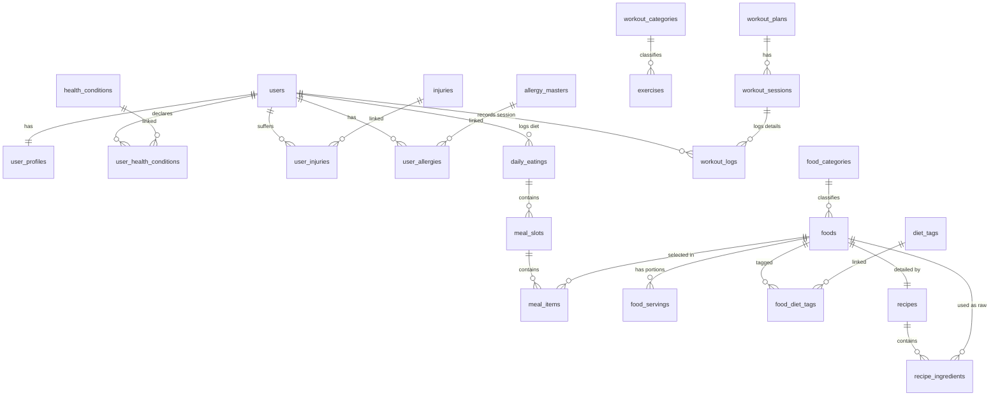

# System Design Document (SDD)

## For BodyPilot

Version 1.0  
Prepared by: Vũ Đặng  
Date: 2026-07-17  

---

## Table of Contents

<!-- TOC -->
* [1. Introduction & Architecture Overview](#1-introduction--architecture-overview)
  * [1.1 Purpose](#11-purpose)
  * [1.2 System Scope](#12-system-scope)
  * [1.3 High-Level Architecture](#13-high-level-architecture)
* [2. Database Design (Schema)](#2-database-design-schema)
  * [2.1 Database Entities & Tables](#21-database-entities--tables)
  * [2.2 Entity Relationship Diagram (ERD)](#22-entity-relationship-diagram-erd)
* [3. Core Algorithmic Logic](#3-core-algorithmic-logic)
  * [3.1 BMI, BMR, TDEE, & Target Calorie Calculations](#31-bmi-bmr-tdee--target-calorie-calculations)
  * [3.2 Exercise Calories Burned Calculation](#32-exercise-calories-burned-calculation)
* [4. API Interface Design](#4-api-interface-design)
  * [4.1 Authentication REST Endpoints](#41-authentication-rest-endpoints)
  * [4.2 Assessment & Profile Endpoints](#42-assessment--profile-endpoints)
  * [4.3 Nutrition & Food Endpoints](#43-nutrition-food-endpoints)
  * [4.4 Workout & Exercise Endpoints](#44-workout--exercise-endpoints)
  * [4.5 AI Suggestion Endpoints](#45-ai-suggestion-endpoints)
* [5. Flutter Client Design & State Management](#5-flutter-client-design--state-management)
  * [5.1 Project Layout](#51-project-layout)
  * [5.2 BLoC State Management Pattern](#52-bloc-state-management-pattern)
* [6. Generative AI Integration Architecture](#6-generative-ai-integration-architecture)
  * [6.1 Workflow Block Diagram](#61-workflow-block-diagram)
  * [6.2 Prompt Engineering Strategy](#62-prompt-engineering-strategy)
<!-- TOC -->

---

## 1. Introduction & Architecture Overview

### 1.1 Purpose
Tài liệu Thiết kế Hệ thống (SDD) này mô tả chi tiết thiết kế kỹ thuật, cấu trúc cơ sở dữ liệu quan hệ, thiết kế API, cấu trúc mã nguồn client và sơ đồ tích hợp AI cho hệ thống **BodyPilot**. Tài liệu này làm kim chỉ nam để các nhà phát triển phần mềm hiểu rõ cách vận hành nội bộ của ứng dụng và phát triển nhất quán.

### 1.2 System Scope
BodyPilot cung cấp các tính năng hỗ trợ dinh dưỡng và thể chất tự động. Nhằm đảm bảo khả năng phản hồi mượt mà và mở rộng dễ dàng, hệ thống được thiết kế theo mô hình kiến trúc phân lớp (3-tier) bao gồm:
- **Presentation Layer**: Client di động cho người dùng (Flutter iOS/Android) và Client Web cho quản trị viên (Flutter Web).
- **Application Layer**: API Server chạy Spring Boot, chịu trách nhiệm xác thực, xử lý luồng tính toán, kết nối database và điều phối tích hợp Gemini AI.
- **Database & External Services Layer**: PostgreSQL đóng vai trò lưu trữ bền vững; Gemini API của Google đóng vai trò xử lý ngôn ngữ và suy luận đề xuất.

### 1.3 High-Level Architecture

```
                 +-------------------------------------------------+
                 |                PRESENTATION LAYER               |
                 |  +--------------------+  +-------------------+  |
                 |  | Flutter Mobile App |  | Flutter Admin Web |  |
                 |  +----------+---------+  +---------+---------+  |
                 +-------------|----------------------|------------+
                               |                      |
                               +-----------+----------+
                                           | (JSON over HTTPS)
                                           v
                 +-------------------------------------------------+
                 |                APPLICATION LAYER                |
                 |       +---------------------------------+       |
                 |       |       Spring Boot API Server    |       |
                 |       |  +---------------------------+  |       |
                 |       |  |     Security & JWT        |  |       |
                 |       |  +---------------------------+  |       |
                 |       |  |  Services & Calculations  |  |       |
                 |       |  +---------------------------+  |       |
                 |       |  |    JPA Repository Mapping |  |       |
                 |       |  +---------------------------+  |       |
                 +-----------------------+-------------+-----------+
                                         |             |
                                  (SQL)  |             | (HTTP REST)
                                         v             v
                 +-------------------------------------------------+
                 |              DATA & SERVICES LAYER              |
                 |       +-------------------+ +-----------------+ |
                 |       |    PostgreSQL     | | Google Gemini   | |
                 |       | (Supabase Engine) | |  (Model 2.5)    | |
                 |       +-------------------+ +-----------------+ |
                 +-------------------------------------------------+
```

---

## 2. Database Design (Schema)

### 2.1 Database Entities & Tables

Hệ thống sử dụng các bảng dữ liệu chuẩn hóa trên cơ sở dữ liệu PostgreSQL. Các bảng chính bao gồm:

#### 2.1.1 Nhóm Quản lý Người dùng & Thể trạng
- **`users`**: Lưu tài khoản đăng nhập chính.
  - `id`: `UUID` (Primary Key, default `gen_random_uuid()`)
  - `email`: `VARCHAR(255)` (Unique, Not Null)
  - `password`: `VARCHAR(255)` (Not Null - Lưu mật khẩu đã mã hóa BCrypt)
  - `created_at`, `updated_at`: `TIMESTAMP`
- **`user_profiles`**: Lưu thông số sinh trắc học và sở thích cơ bản.
  - `id`: `UUID` (Primary Key)
  - `user_id`: `UUID` (Foreign Key -> `users.id`)
  - `gender`: `VARCHAR(10)` (MALE, FEMALE)
  - `age`: `INTEGER`
  - `height_cm`: `DOUBLE PRECISION`
  - `weight`: `DOUBLE PRECISION`
  - `target_weight`: `DOUBLE PRECISION`
  - `activity_level`: `VARCHAR(50)` (SEDENTARY, LIGHT, MODERATE, ACTIVE, VERY_ACTIVE)
  - `goal`: `VARCHAR(50)` (MAINTAIN, LOSE_0_5KG, etc.)
  - `has_experience`: `BOOLEAN`
  - `food_budget`: `VARCHAR(50)`
  - `selected_diet_tag_id`: `UUID` (Foreign Key -> `diet_tags.id`)

#### 2.1.2 Nhóm Hạn chế Sức khỏe (Bệnh lý, Chấn thương, Dị ứng)
- **`health_conditions`**: Danh mục bệnh lý hệ thống.
  - `id`: `UUID` (Primary Key)
  - `name`: `VARCHAR(255)` (Not Null)
  - `code`: `VARCHAR(100)` (Unique)
  - `affects_diet`, `affects_workout`: `BOOLEAN`
  - `severity_level`: `VARCHAR(50)` (LOW, MEDIUM, HIGH)
- **`injuries`**: Danh mục các chấn thương hệ thống.
  - `id`: `UUID` (Primary Key)
  - `name`: `VARCHAR(255)`
  - `code`: `VARCHAR(100)` (Unique)
  - `body_part`: `VARCHAR(50)` (KNEE, BACK, SHOULDER, ARM, LEG, etc.)
  - `restricted_exercises`: `TEXT[]` (Mảng chứa tên/mã các bài tập cấm)
- **`allergy_masters`**: Danh mục các chất dị ứng hệ thống.
  - `id`: `UUID` (Primary Key)
  - `name`: `VARCHAR(255)` (Unique)
  - `code`: `VARCHAR(100)` (Unique)
- **`user_health_conditions` / `user_injuries` / `user_allergies`**: Các bảng trung gian kết nối `user_id` với các bảng danh mục hạn chế sức khỏe tương ứng nhằm hỗ trợ quan hệ Many-to-Many.

#### 2.1.3 Nhóm Thực phẩm & Dinh dưỡng
- **`diet_tags`**: Các chế độ ăn kiêng (Keto, Vegan, Vegetarian, Low-Carb, Clean Eating...).
- **`foods`**: Thực phẩm hoặc món ăn.
  - `id`: `UUID` (Primary Key)
  - `name`: `VARCHAR(255)`
  - `type`: `VARCHAR(50)` (DISH, INGREDIENT)
  - `calories_per_100g`, `protein_per_100g`, `fat_per_100g`, `carbs_per_100g`, `fiber_per_100g`, `sugar_per_100g`, `sodium_mg_per_100g`: `DECIMAL`
  - `category_id`: `UUID` (Foreign Key -> `food_categories.id`)
  - `image_url`: `TEXT`
- **`food_servings`**: Quy đổi khẩu phần ăn (Ví dụ: 1 bát cơm, 1 quả táo...).
- **`recipes` / `recipe_ingredients`**: Các nguyên liệu và công thức nấu nướng dành cho thực phẩm có kiểu là `DISH`.
- **`daily_eatings`**: Nhật ký ăn uống của người dùng theo ngày.
  - `id`: `UUID` (Primary Key)
  - `user_id`: `UUID` (Foreign Key -> `users.id`)
  - `date`: `DATE` (Not Null)
- **`meal_slots`**: Bữa ăn trong ngày (Breakfast, Lunch, Dinner, Snack).
  - `id`: `UUID` (Primary Key)
  - `daily_eating_id`: `UUID` (Foreign Key -> `daily_eatings.id`)
  - `slot_type`: `VARCHAR(50)`
- **`meal_items`**: Món ăn chi tiết được chọn trong bữa ăn.
  - `id`: `UUID` (Primary Key)
  - `meal_slot_id`: `UUID` (Foreign Key -> `meal_slots.id`)
  - `food_id`: `UUID` (Foreign Key -> `foods.id`)
  - `amount_g`: `DOUBLE PRECISION` (Khối lượng gam tiêu thụ)

#### 2.1.4 Nhóm Luyện tập
- **`workout_categories`**: Danh mục phân loại bài tập (Gym, Cardio, Yoga).
- **`exercises`**: Thư viện bài tập chi tiết.
  - `id`: `UUID` (Primary Key)
  - `category_id`: `UUID` (Foreign Key -> `workout_categories.id`)
  - `code`: `VARCHAR(50)` (Unique)
  - `name`: `VARCHAR(255)`
  - `description`: `TEXT`
  - `media_url`: `TEXT`
  - `difficulty`: `VARCHAR(50)` (BEGINNER, INTERMEDIATE, ADVANCED)
  - `met_value`: `DOUBLE PRECISION` (Hệ số tương đương chuyển hóa)
  - `equipment`: `JSONB` (Danh sách dụng cụ tạ đòn, tạ đơn,...)
  - `target_muscles`: `JSONB` (Cơ ngực, đùi, vai...)
- **`workout_plans`**: Giáo án luyện tập (ví dụ: Push-Pull-Legs).
- **`workout_sessions`**: Buổi tập trong giáo án (Ngày 1: Push, Ngày 2: Legs).
  - `id`: `UUID` (Primary Key)
  - `plan_id`: `UUID` (Foreign Key -> `workout_plans.id`)
  - `day_number`: `INTEGER`
  - `name`: `VARCHAR(255)`
  - `exercise_items`: `JSONB` (Mảng chứa cấu trúc tập: `exerciseId`, `sets`, `reps`, `weightKg`, `restSeconds`)
- **`workout_logs`**: Nhật ký hoàn thành buổi tập thực tế của người dùng.
  - `id`: `UUID` (Primary Key)
  - `user_id`: `UUID`
  - `session_id`: `UUID` (Foreign Key -> `workout_sessions.id`)
  - `start_time`, `end_time`: `TIMESTAMP`
  - `total_calories`: `DOUBLE PRECISION`
  - `mood_rating`: `INTEGER`
  - `actual_performance`: `JSONB` (Số sets/reps thực tế tập được)

---

### 2.2 Entity Relationship Diagram (ERD)



---

## 3. Core Algorithmic Logic

### 3.1 BMI, BMR, TDEE, & Target Calorie Calculations
Bộ xử lý logic tại Spring Boot (`CalorieCalculatorService`) tự động tính toán các chỉ số sức khỏe của người dùng:

1. **BMI (Body Mass Index)**:
   $$\text{BMI} = \frac{\text{Cân nặng (kg)}}{(\text{Chiều cao (m)})^2}$$

2. **BMR (Basal Metabolic Rate)**: Tính theo phương trình Mifflin-St Jeor:
   - Nam giới: 
     $$\text{BMR} = 10 \times \text{Cân nặng (kg)} + 6.25 \times \text{Chiều cao (cm)} - 5 \times \text{Tuổi (năm)} + 5$$
   - Nữ giới: 
     $$\text{BMR} = 10 \times \text{Cân nặng (kg)} + 6.25 \times \text{Chiều cao (cm)} - 5 \times \text{Tuổi (năm)} - 161$$

3. **TDEE (Total Daily Energy Expenditure)**:
   $$\text{TDEE} = \text{BMR} \times \text{Hệ số vận động (Multiplier)}$$
   - Thụ động (`SEDENTARY`): 1.2
   - Nhẹ (`LIGHT`): 1.375
   - Vừa (`MODERATE`): 1.55
   - Năng động (`ACTIVE`): 1.725
   - Rất năng động (`VERY_ACTIVE`): 1.9

4. **Target Calories**: Lượng calo nạp hàng ngày điều chỉnh theo mục tiêu sức khỏe:
   - Duy trì cân nặng (`MAINTAIN`, `HEALTHY_LIFESTYLE`): Target = TDEE
   - Giảm cân 0.5kg/tuần (`LOSE_0_5KG`): Target = TDEE - 500
   - Giảm cân 1.0kg/tuần (`LOSE_1KG`): Target = TDEE - 1000
   - Tăng cân 0.5kg/tuần (`GAIN_0_5KG`): Target = TDEE + 500
   - Tăng cân 1.0kg/tuần (`GAIN_1KG`): Target = TDEE + 1000
   - Tăng cơ nạc (`GAIN_MUSCLE`): Target = TDEE + 300

---

### 3.2 Exercise Calories Burned Calculation
Lượng calo tiêu hao khi tập luyện được ước tính dựa trên chỉ số **MET** (Metabolic Equivalent of Task) của bài tập:
$$\text{Calories tiêu thụ} = \text{MET} \times \text{Cân nặng (kg)} \times \left( \frac{\text{Thời gian tập (Phút)}}{60} \right)$$
Ví dụ: Người dùng nặng 70kg, tập Barbell Squat (MET = 6.0) trong 45 phút sẽ tiêu thụ:
$$\text{Calories} = 6.0 \times 70 \times \left( \frac{45}{60} \right) = 315 \text{ kcal}$$

---

## 4. API Interface Design

Hệ thống cung cấp các API endpoints định dạng RESTful JSON như sau:

### 4.1 Authentication REST Endpoints
- **POST `/api/v1/auth/signup`**: Đăng ký tài khoản người dùng mới.
  - Request Body: `{"email": "user@example.com", "password": "securepassword"}`
  - Response: `200 OK` (Đăng ký thành công).
- **POST `/api/v1/auth/login`**: Đăng nhập hệ thống.
  - Request Body: `{"email": "user@example.com", "password": "securepassword"}`
  - Response: `{"token": "JWT_STRING_HERE", "userId": "UUID_HERE"}`

### 4.2 Assessment & Profile Endpoints
- **POST `/api/v1/users/{userId}/assessment`**: Gửi kết quả khảo sát 12 bước đầu vào.
  - Request Body: `AssessmentSubmissionRequest` (bao gồm chiều cao, cân nặng, chấn thương, dị ứng, mục tiêu, mức độ hoạt động...).
  - Response: `{"message": "Assessment submitted successfully", "status": 200}`
- **GET `/api/v1/users/{userId}`**: Lấy chi tiết hồ sơ cá nhân và các chỉ số thể trạng đã tính toán (BMI, BMR, TDEE, calo mục tiêu).

### 4.3 Nutrition & Food Endpoints
- **GET `/api/v1/foods`**: Danh sách thực phẩm và món ăn, hỗ trợ phân trang và tìm kiếm theo tên.
- **GET `/api/v1/users/{userId}/nutrition-diary`**: Lấy nhật ký ăn uống của người dùng theo ngày được chỉ định (mặc định là hôm nay).
  - Response: Trả về danh sách 4 bữa ăn (`Breakfast`, `Lunch`, `Dinner`, `Snack`) kèm tổng lượng calo và macros đã tiêu thụ.
- **POST `/api/v1/users/{userId}/nutrition-diary/meal-item`**: Thêm thực phẩm đã ăn vào một bữa chính.
  - Request Body: `{"foodId": "UUID", "slotType": "BREAKFAST", "amountG": 150.0}`

### 4.4 Workout & Exercise Endpoints
- **GET `/api/v1/exercises`**: Tìm kiếm bài tập trong thư viện hệ thống theo nhóm cơ, thiết bị hoặc mức độ khó.
- **GET `/api/v1/workout-plans`**: Lấy các kế hoạch/giáo án tập luyện mẫu (như Push-Pull-Legs).
- **POST `/api/v1/users/{userId}/workout-diary`**: Lưu nhật ký hoàn thành một buổi tập thể hình hoặc cardio.
  - Request Body: `{"sessionId": "UUID", "startTime": "...", "endTime": "...", "notes": "...", "actualPerformance": [...]}`

### 4.5 AI Suggestion Endpoints
- **GET `/api/v1/users/{userId}/ai-diet-suggestion`**: Yêu cầu AI sinh thực đơn ăn kiêng tối ưu dựa trên hồ sơ sức khỏe và ngân sách.
  - Response Code: `200 OK`
  - Output: Nội dung đề xuất dạng chuỗi Markdown/JSON chứa lịch thực đơn 7 ngày.
- **GET `/api/v1/users/{userId}/ai-workout-suggestion`**: Yêu cầu AI sinh lịch trình tập luyện loại bỏ chấn thương và phù hợp mục tiêu.

---

## 5. Flutter Client Design & State Management

### 5.1 Project Layout
Mã nguồn ứng dụng di động Flutter chia tách thành các tầng logic rõ ràng theo nguyên tắc Clean Architecture:

```
lib/
├── core/
│   ├── theme/            # Phong cách giao diện, màu sắc chủ đạo
│   ├── network/          # Http Client cấu hình JWT Header
│   └── utils/            # Các lớp tiện ích phụ trợ
├── data/
│   ├── models/           # DTOs ánh xạ dữ liệu JSON
│   └── repositories/     # Gọi API và xử lý lỗi kết nối
└── presentation/
    ├── bloc/             # Lớp quản lý trạng thái của từng phân hệ
    │   ├── assessment/
    │   ├── auth/
    │   ├── meal/
    │   └── workout/
    ├── screens/          # Các trang màn hình giao diện chính
    │   ├── assessment/   # Giao diện khảo sát 12 bước
    │   ├── meal/         # Ghi chép ăn uống & Đề xuất AI
    │   └── workout/      # Hướng dẫn tập luyện & Đếm giờ tập
    └── widgets/          # Các widget UI tái sử dụng
```

### 5.2 BLoC State Management Pattern
Trạng thái ứng dụng được quản lý thông qua **Flutter BLoC**. Mỗi phân hệ bao gồm `Bloc`, `Event` và `State`:

- **`AssessmentBloc`**:
  - `AssessmentEvent`:
    - `NextStepEvent`: Chuyển đổi qua lại giữa 12 bước khảo sát.
    - `SubmitAssessmentEvent`: Gửi dữ liệu khảo sát lên backend.
  - `AssessmentState`:
    - `AssessmentStepState`: Trạng thái bước hiện tại cùng dữ liệu tạm thời.
    - `AssessmentSubmitting`: Đang gửi dữ liệu lên server.
    - `AssessmentSuccess`/`AssessmentFailure`.

- **`MealBloc`**:
  - `MealEvent`:
    - `FetchDailyMealEvent`: Lấy thông tin bữa ăn của ngày.
    - `AddMealItemEvent`: Thêm món ăn vào nhật ký.
    - `RequestAiDietSuggestionEvent`: Gọi API AI gợi ý thực đơn.
  - `MealState`:
    - `MealLoading`: Đang tải dữ liệu ăn uống.
    - `MealLoaded`: Hiển thị danh sách món đã ăn và tiến trình calo.
    - `AiSuggestionLoading`: Đang chờ AI phản hồi.
    - `AiSuggestionSuccess` (chứa nội dung Markdown thực đơn).

---

## 6. Generative AI Integration Architecture

### 6.1 Workflow Block Diagram

```
+---------------+     User Request     +--------------------+
| Flutter App   +--------------------->+ Spring Boot API    |
| (Meal/Workout)|                      |                    |
+-------^-------+                      +---------+----------+
        |                                        |
        |                                        | 1. Query User Metrics,
        |                                        |    Allergies & Injuries
        |                                        v
        |                              +---------+----------+
        |  Parse & Send                | PostgreSQL         |
        |  Markdown Response           | (Supabase)         |
        |                              +---------+----------+
        |                                        |
        |                                        | 2. Return User Profile Context
        |                                        v
+-------+-------+     JSON Request     +---------+----------+
| Google Gemini +<---------------------+ AI Prompt Service  |
| API (Flash)   |  (Context + Prompt)  | (Backend Service)  |
+---------------+                      +--------------------+
```

### 6.2 Prompt Engineering Strategy
Để nhận kết quả tối ưu từ mô hình `gemini-2.5-flash`, hệ thống xây dựng câu lệnh (Prompt) kết hợp giữa cấu trúc cố định và thông tin cá nhân động của người dùng:

#### 6.2.1 System Prompt (Quy chuẩn hoạt động của AI)
```
Bạn là một chuyên gia dinh dưỡng và huấn luyện viên cá nhân ảo chuyên nghiệp.
Nhiệm vụ của bạn là lập kế hoạch ăn uống hoặc luyện tập khoa học phù hợp với người dùng.
Quy định bắt buộc:
1. Phải tuyệt đối tránh các thực phẩm dị ứng nằm trong danh sách dị ứng do người dùng khai báo.
2. Phải loại bỏ hoàn toàn các động tác tác động tiêu cực lên vùng chấn thương do người dùng khai báo.
3. Căn chỉnh lượng Calo và tỷ lệ Macros (Protein, Carbs, Fat) khớp với Calo mục tiêu của người dùng.
4. Ưu tiên các thực đơn nằm trong khoảng ngân sách yêu cầu.
5. Cung cấp câu trả lời rõ ràng dưới định dạng Markdown có phân cấp rõ rệt.
```

#### 6.2.2 User Prompt Template (Truyền thông tin động)
```
Hãy thiết kế thực đơn ăn uống cho người dùng có các thông số sau:
- Mục tiêu thể chất: {selectedGoal}
- Giới tính: {selectedGender}, Tuổi: {age} tuổi
- Chiều cao: {heightCm} cm, Cân nặng: {weight} kg
- Lượng calo nạp hàng ngày mục tiêu: {targetCalories} kcal
- Dị ứng thực phẩm: {selectedAllergies}
- Thực phẩm không thích ăn: {dislikedFoodGroups}
- Chế độ ăn ưu tiên: {dietPreference}
- Ngân sách thực phẩm: {foodBudget}
- Yêu cầu thêm: Hãy gợi ý thực đơn chi tiết chia đều cho 4 bữa Breakfast, Lunch, Dinner và Snack cho từng ngày trong tuần.
```
Bằng cách phân tách cấu trúc này, backend kiểm soát được độ chính xác và tính an toàn của nội dung phản hồi, hạn chế tối đa việc sinh dữ liệu sai lệch (hallucination).
