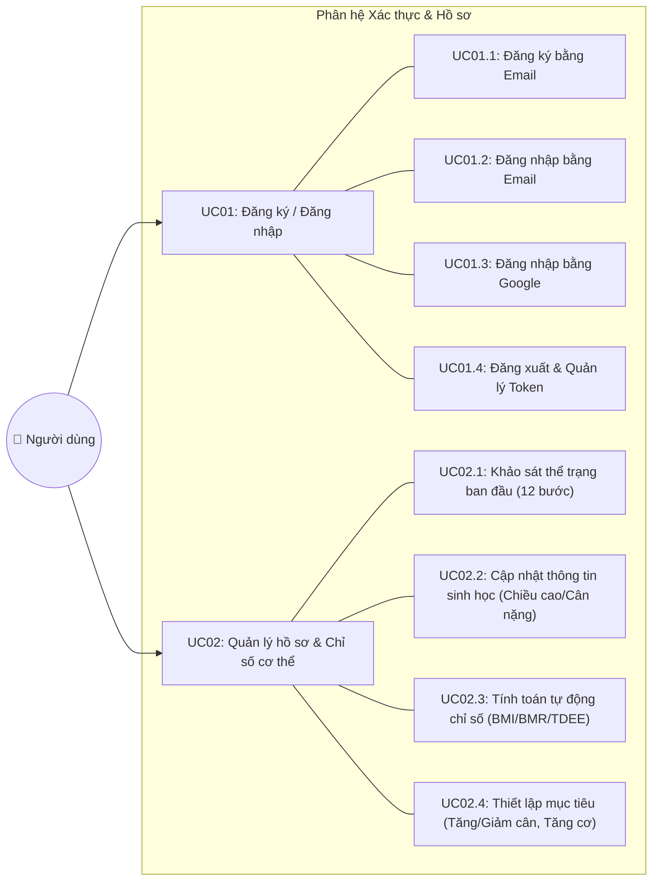
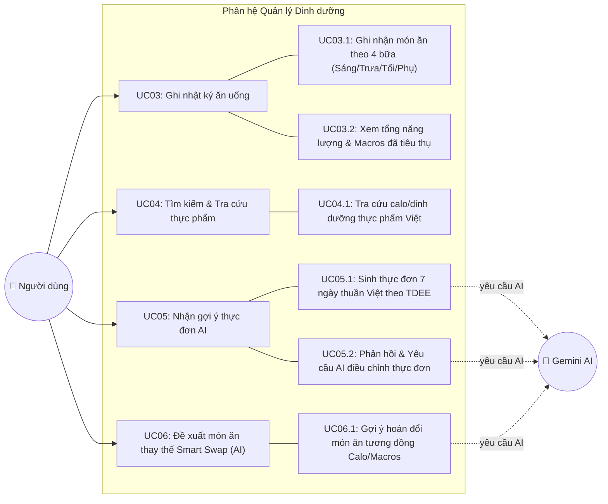
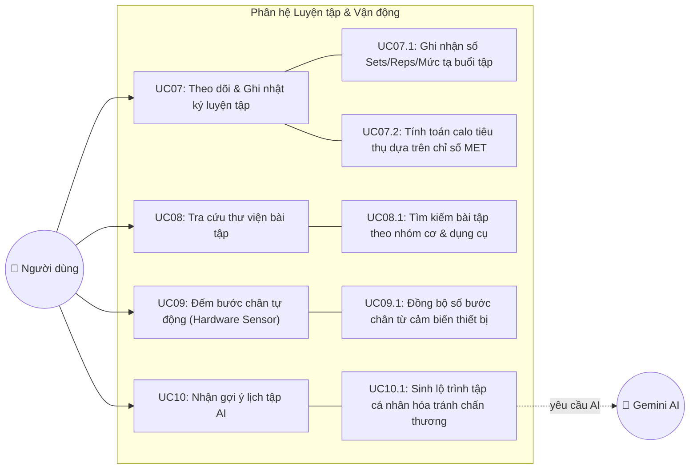
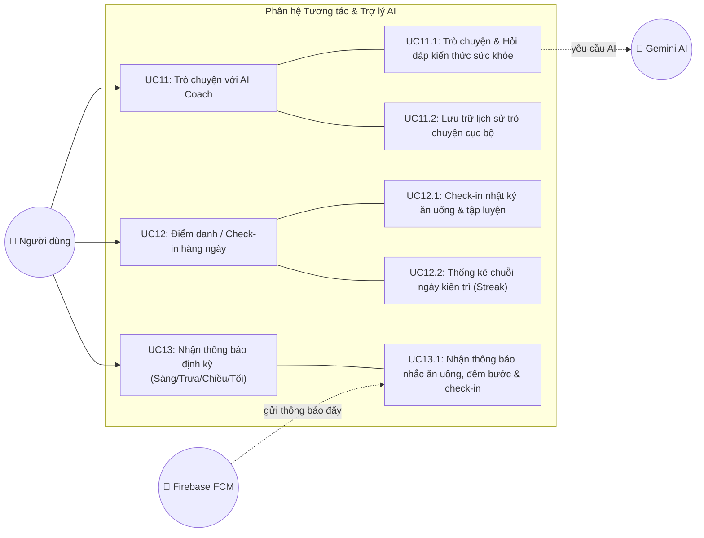
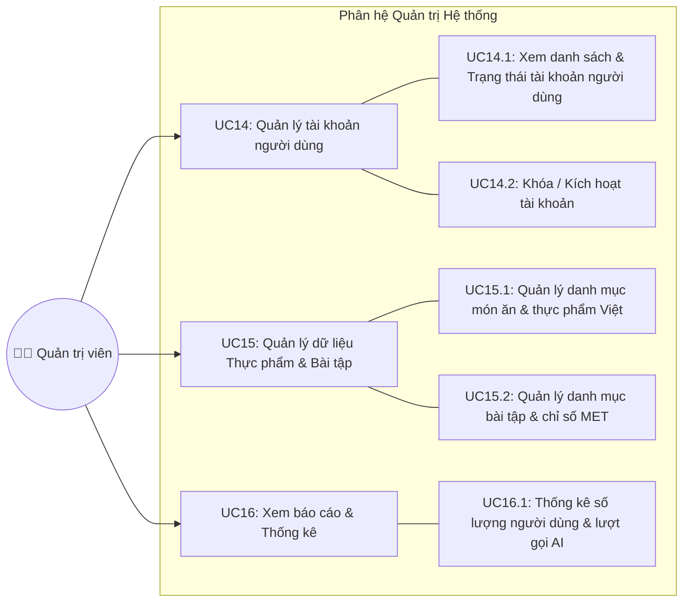

# 2.2. PHÂN RÃ CÁC USE CASE MỨC CAO

Tài liệu này tiến hành phân rã chi tiết từng Use Case mức cao đã được xác định trong biểu đồ Use Case tổng quan của hệ thống **BodyPilot**. Mỗi phân hệ được trình bày trong một mục riêng bao gồm biểu đồ Mermaid phân rã và phần giải thích ngắn gọn cho từng Use Case con.

---

## 2.2.1. Phân rã Use Case: Xác thực & Hồ sơ

Biểu đồ dưới đây thể hiện việc phân rã Use Case mức cao **Xác thực & Hồ sơ** thành các Use Case con phục vụ việc quản lý tài khoản và thiết lập thể trạng ban đầu của người dùng.

### Giải thích ngắn gọn:

- **UC01: Đăng ký / Đăng nhập:** Cho phép người dùng truy cập hệ thống qua 3 hình thức: Đăng ký tài khoản Email mới (UC01.1), Đăng nhập bằng Email/Password (UC01.2), hoặc Đăng nhập nhanh qua Google OAuth2 (UC01.3). UC01.4 xử lý việc thu hồi mã JWT khi đăng xuất.
- **UC02: Quản lý hồ sơ & Chỉ số cơ thể:** Hỗ trợ người dùng hoàn thành bộ khảo sát thể trạng 12 bước (UC02.1), cập nhật định kỳ cân nặng/chiều cao (UC02.2). Hệ thống tự động áp dụng công thức Mifflin-St Jeor để tính BMR/TDEE/BMI (UC02.3) và thiết lập lượng calo mục tiêu (UC02.4).

---

## 2.2.2. Phân rã Use Case: Quản lý Dinh dưỡng

Biểu đồ dưới đây phân rã chi tiết các Use Case thuộc phân hệ **Quản lý Dinh dưỡng**, kết hợp giữa ghi nhận thủ công và ứng dụng Generative AI.

### Giải thích ngắn gọn:

- **UC03: Ghi nhật ký ăn uống:** Người dùng lưu trữ thực phẩm ăn theo từng bữa trong ngày (UC03.1) và xem tiến độ Calo/Carbs/Protein/Fat nạp vào so với hạn mức (UC03.2).
- **UC04: Tìm kiếm & Tra cứu thực phẩm:** Cho phép tìm kiếm nhanh thông tin dinh dưỡng trên 100g món ăn Việt từ cơ sở dữ liệu đã chuẩn hóa (UC04.1).
- **UC05: Nhận gợi ý thực đơn AI:** AI tự động khởi tạo thực đơn 7 ngày phù hợp với calo/dị ứng/bệnh lý (UC05.1) và tiếp nhận phản hồi để điều chỉnh thực đơn theo yêu cầu (UC05.2).
- **UC06: Đề xuất món ăn thay thế Smart Swap (AI):** AI tìm kiếm và đề xuất các món ăn thay thế đáp ứng đúng định mức calo/macro khi người dùng muốn đổi món (UC06_1).

---

## 2.2.3. Phân rã Use Case: Luyện tập & Vận động

Biểu đồ dưới đây phân rã Use Case mức cao **Luyện tập & Vận động** bao gồm thư viện bài tập, gợi ý lịch tập AI và theo dõi bước chân tự động.

### Giải thích ngắn gọn:

- **UC07: Theo dõi & Ghi nhật ký luyện tập:** Cho phép lưu chi tiết các hiệp tập (UC07.1) và tự động tính lượng calo tiêu hao dựa trên chỉ số chuyển hóa MET của bài tập (UC07.2).
- **UC08: Tra cứu thư viện bài tập:** Tìm kiếm bài tập thể hình kèm hình ảnh/hướng dẫn phân loại theo nhóm cơ và thiết bị (UC08.1).
- **UC09: Đếm bước chân tự động (Hardware Sensor):** Tự động đọc dữ liệu bước chân thời gian thực từ cảm biến Pedometer của điện thoại mà không cần thiết bị đeo ngoài (UC09.1).
- **UC10: Nhận gợi ý lịch tập AI:** AI xây dựng giáo án tập luyện cá nhân hóa phù hợp với mục tiêu và tự động loại trừ các bài tập gây áp lực lên vùng chấn thương của người dùng (UC10.1).

---

## 2.2.4. Phân rã Use Case: Tương tác & Trợ lý AI

Biểu đồ dưới đây thể hiện sự phân rã của nhóm Use Case **Tương tác & Trợ lý AI** phục vụ việc tư vấn 24/7 và gia tăng sự gắn kết của người dùng.

### Giải thích ngắn gọn:

- **UC11: Trò chuyện với AI Coach:** Cho phép hỏi đáp tự nhiên với trợ lý AI về dinh dưỡng/luyện tập (UC11.1) và lưu lại lịch sử hội thoại ngay trên thiết bị di động (UC11.2).
- **UC12: Điểm danh / Check-in hàng ngày:** Đánh dấu hoàn thành thói quen theo dõi dinh dưỡng/tập luyện trong ngày (UC12.1) và duy trì chỉ số chuỗi ngày liên tục Streak (UC12.2).
- **UC13: Nhận thông báo định kỳ:** Tiếp nhận các thông báo nhắc nhở đẩy tự động từ Firebase FCM theo 4 mốc thời gian vàng trong ngày (UC13.1).

---

## 2.2.5. Phân rã Use Case: Quản trị Hệ thống

Biểu đồ dưới đây phân rã chi tiết phân hệ **Quản trị Hệ thống (Admin Web Dashboard)** dành cho Quản trị viên điều hành.

### Giải thích ngắn gọn:

- **UC14: Quản lý tài khoản người dùng:** Giúp Admin giám sát danh sách người dùng đăng ký (UC14.1) và quản lý quyền truy cập hoặc khóa tài khoản vi phạm (UC14.2).
- **UC15: Quản lý dữ liệu Thực phẩm & Bài tập:** Cho phép thêm, sửa, xóa kho thực phẩm/món ăn Việt Nam chuẩn hóa (UC15.1) và thư viện bài tập thể hình (UC15.2).
- **UC16: Xem báo cáo & Thống kê:** Hiển thị biểu đồ theo dõi tổng quan số lượng người dùng mới, tần suất sử dụng ứng dụng và thống kê các lượt yêu cầu API tới mô hình Gemini AI (UC16.1).
