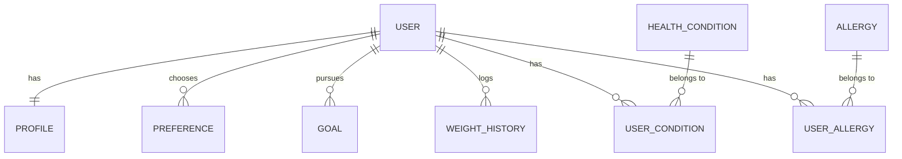

# Database Entity Design - BodyPilot

This document outlines the proposed database schema for the BodyPilot backend, designed to support the mobile assessment flow and future AI-powered features.

## Design Philosophy
- **Normalization**: Data is split into logical modules to avoid redundant updates and simplify queries.
- **AI-Ready**: Historical data (e.g., weight) is tracked over time, providing a rich dataset for AI analysis.
- **Scalability**: UUIDs are used for IDs to facilitate distributed architecture and secure resource referencing.
- **Separation of Concerns**: Authentication is separated from physical profiles and lifestyle preferences.

---

## 🏗️ List of Entities

### 1. Core Identity & Profile (Static/Semi-Static)
- **`User`**: Account authentication and basic identity.
- **`Profile`**: Core physical characteristics (Gender, Date of Birth, Height).
- **`PerformanceLevel`**: Workout experience tracking.

### 2. Lifestyle & Preferences (Dynamic/Snapshot)
- **`Preference`**: Current lifestyle habits (Diet type, Sleep quality, Exercise preference).

### 3. Health & Restrictions (Static Masters + Mapping)
- **`HealthCondition`**: Master table of medical conditions.
- **`UserCondition`**: Pivot table mapping users to conditions.
- **`Allergy`**: Master table of food allergies and categories.
- **`UserAllergy`**: Pivot table mapping users to allergies.

### 4. Goals & Metrics (Dynamic)
- **`Goal`**: Current fitness objective and target weight.
- **`WeightLog`**: Time-series data for weight tracking (crucial for AI analysis).

---

## 📊 Table Structures

### 🟢 `users`
| Field | Type | Description |
| :--- | :--- | :--- |
| `id` | `UUID` (PK) | Unique identifier |
| `email` | `VARCHAR(255)` | Unique login email |
| `password_hash` | `TEXT` | Encrypted password |
| `created_at` | `TIMESTAMP` | Record creation time |
| `updated_at` | `TIMESTAMP` | Last update time |

### 🟢 `profiles`
| Field | Type | Description |
| :--- | :--- | :--- |
| `user_id` | `UUID` (PK, FK) | Reference to `users.id` |
| `gender` | `ENUM` | `MALE`, `FEMALE`, `OTHER` |
| `date_of_birth` | `DATE` | Stored as date to keep age accurate over time |
| `height` | `DECIMAL(5,2)` | Height in cm |
| `has_experience` | `BOOLEAN` | True if user has workout experience |

### 🟢 `preferences`
| Field | Type | Description |
| :--- | :--- | :--- |
| `id` | `UUID` (PK) | Unique identifier |
| `user_id` | `UUID` (FK) | Reference to `users.id` |
| `diet_type` | `VARCHAR(50)` | E.g., `VEGAN`, `KETO`, `LOW_CARB` |
| `sleep_quality` | `VARCHAR(50)` | E.g., `EXCELLENT`, `POOR` |
| `exercise_preference` | `VARCHAR(50)` | E.g., `JOGGING`, `WEIGHTLIFTING` |
| `is_active` | `BOOLEAN` | To track current vs historical preferences |

### 🟢 `goals`
| Field | Type | Description |
| :--- | :--- | :--- |
| `id` | `UUID` (PK) | Unique identifier |
| `user_id` | `UUID` (FK) | Reference to `users.id` |
| `goal_type` | `VARCHAR(50)` | E.g., `LOSE_WEIGHT`, `GAIN_MUSCLE` |
| `start_weight` | `DECIMAL(5,2)` | Weight at the start of the goal |
| `target_weight` | `DECIMAL(5,2)` | Desired end weight |
| `start_date` | `DATE` | When the goal was set |
| `status` | `ENUM` | `ACTIVE`, `COMPLETED`, `ABANDONED` |

### 🟢 `weight_history` (Dynamic Data)
| Field | Type | Description |
| :--- | :--- | :--- |
| `id` | `BIGINT` (PK) | Auto-increment ID |
| `user_id` | `UUID` (FK) | Reference to `users.id` |
| `weight` | `DECIMAL(5,2)` | Captured weight |
| `recorded_at` | `TIMESTAMP` | Time of measurement |

### 🟡 Health & Restrictions (Master Data)
- **`health_conditions`**: `id` (INT), `name` (STRING), `icon_key` (STRING)
- **`allergies`**: `id` (INT), `name` (STRING), `category` (STRING)
- **`user_health_mapping`**: `user_id` (UUID), `condition_id` (INT)
- **`user_allergy_mapping`**: `user_id` (UUID), `allergy_id` (INT)

---

## 🔗 Relationship Diagram

---

## 🧠 Design Decisions & Rationale

1.  **Date of Birth vs. Age**: We store `date_of_birth` rather than `age`. An integer age becomes stale within a year; a DOB allows the system to calculate current age dynamically every time an AI calculation (BMR, macros) is run.
2.  **State Management (Active Preferences)**: By keeping `preferences` in a separate table with an `is_active` flag, we can track how a user's lifestyle changes over time, which is valuable for "reasoning" in AI recommendations.
3.  **Separate Weight Tracking**: The `weight_history` table allows us to build progress charts and for AI to detect trends (plateaus, rapid loss) based on real data points.
4.  **Normalization of Restrictions**: Using master tables for `health_conditions` and `allergies` allows the system to expand without schema changes as we add more options to the assessment flow.
5.  **Modular Goals**: `target_weight` is tied to a `Goal` entity. This acknowledges that a user's target weight is temporary and changes based on their phase (Bulking vs. Cutting).

---

## 🎯 AI Feature Scalability
- **Training Context**: The historical tables (`weight_history`, `preferences`) provide structured input for identifying patterns.
- **Filtering Logic**: Mapping tables for allergies/conditions provide a clean way for AI engines to query user constraints when generating meal or workout plans.

## Open Questions
- Do we need to track specific **Medications** alongside conditions?
- Should we support **social login** identifiers in the `users` table now or later?
